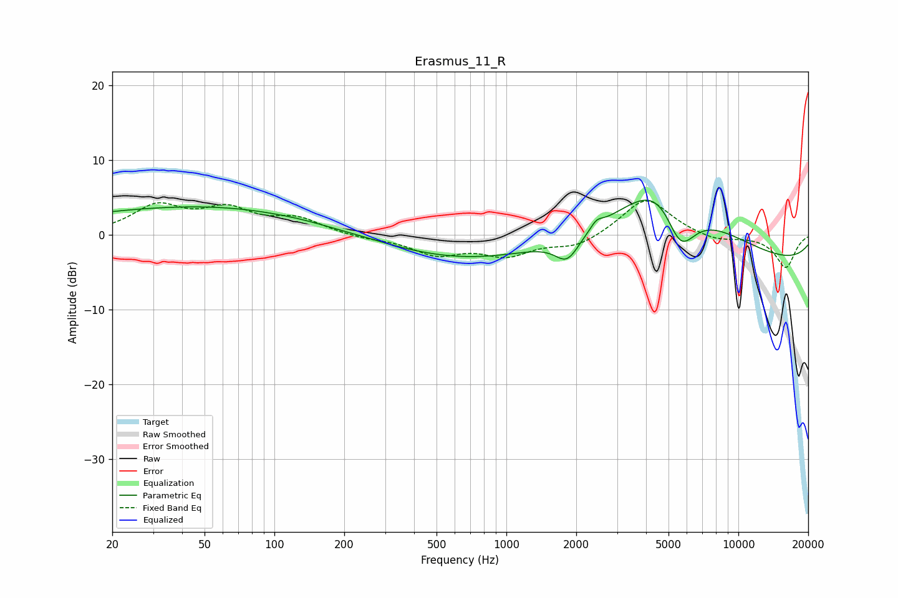

# Erasmus_11_R
See [usage instructions](https://github.com/jaakkopasanen/AutoEq#usage) for more options and info.

### Parametric EQs
Apply preamp of -4.7 dB when using parametric equalizer.

|   # | Type    |   Fc (Hz) |    Q |   Gain (dB) |
|-----|---------|-----------|------|-------------|
|   1 | Peaking |        55 | 0.18 |         3.6 |
|   2 | Peaking |       108 | 0.41 |         2.6 |
|   3 | Peaking |       129 | 2.08 |         0.1 |
|   4 | Peaking |       286 | 0.64 |         0.4 |
|   5 | Peaking |       331 | 0.21 |        -4.7 |
|   6 | Peaking |      1829 | 2.72 |        -3.2 |
|   7 | Peaking |      2446 | 5.3  |         1   |
|   8 | Peaking |      4854 | 0.69 |        13.3 |
|   9 | Peaking |      5606 | 1.8  |        -9   |
|  10 | Peaking |     10000 | 0.18 |        -4.2 |

### Fixed Band EQs
When using fixed band (also called graphic) equalizer, apply preamp of **-4.6 dB** (if available) and set gains manually with these parameters.

|   # | Type    |   Fc (Hz) |    Q |   Gain (dB) |
|-----|---------|-----------|------|-------------|
|   1 | Peaking |        31 | 1.41 |         3.7 |
|   2 | Peaking |        62 | 1.41 |         3.1 |
|   3 | Peaking |       125 | 1.41 |         2   |
|   4 | Peaking |       250 | 1.41 |        -0.4 |
|   5 | Peaking |       500 | 1.41 |        -2.4 |
|   6 | Peaking |      1000 | 1.41 |        -2.5 |
|   7 | Peaking |      2000 | 1.41 |        -1.6 |
|   8 | Peaking |      4000 | 1.41 |         5.1 |
|   9 | Peaking |      8000 | 1.41 |        -0.9 |
|  10 | Peaking |     16000 | 1.41 |        -4.4 |

### Graphs

