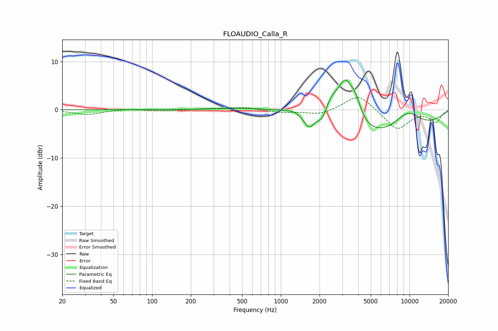

# FLOAUDIO_Calla_R
See [usage instructions](https://github.com/jaakkopasanen/AutoEq#usage) for more options and info.

### Parametric EQs
Apply preamp of -6.3 dB when using parametric equalizer.

|   # | Type    |   Fc (Hz) |    Q |   Gain (dB) |
|-----|---------|-----------|------|-------------|
|   1 | Peaking |       874 | 0.51 |         1.4 |
|   2 | Peaking |      1336 | 1.46 |         1.7 |
|   3 | Peaking |      1681 | 2.73 |        -4.2 |
|   4 | Peaking |      1789 | 4.11 |         0.6 |
|   5 | Peaking |      2121 | 3.64 |        -3.2 |
|   6 | Peaking |      2361 | 1.62 |         5.9 |
|   7 | Peaking |      3197 | 2.19 |         8.5 |
|   8 | Peaking |      3826 | 3.54 |         3.1 |
|   9 | Peaking |      5197 | 0.25 |        -7.2 |
|  10 | Peaking |      9609 | 1.04 |         5   |

### Fixed Band EQs
When using fixed band (also called graphic) equalizer, apply preamp of **-2.6 dB** (if available) and set gains manually with these parameters.

|   # | Type    |   Fc (Hz) |    Q |   Gain (dB) |
|-----|---------|-----------|------|-------------|
|   1 | Peaking |        31 | 1.41 |        -1   |
|   2 | Peaking |        62 | 1.41 |         0.2 |
|   3 | Peaking |       125 | 1.41 |        -0.2 |
|   4 | Peaking |       250 | 1.41 |         0.2 |
|   5 | Peaking |       500 | 1.41 |         0.6 |
|   6 | Peaking |      1000 | 1.41 |        -0.5 |
|   7 | Peaking |      2000 | 1.41 |        -1   |
|   8 | Peaking |      4000 | 1.41 |         3.3 |
|   9 | Peaking |      8000 | 1.41 |        -4.2 |
|  10 | Peaking |     16000 | 1.41 |        -2.5 |

### Graphs

