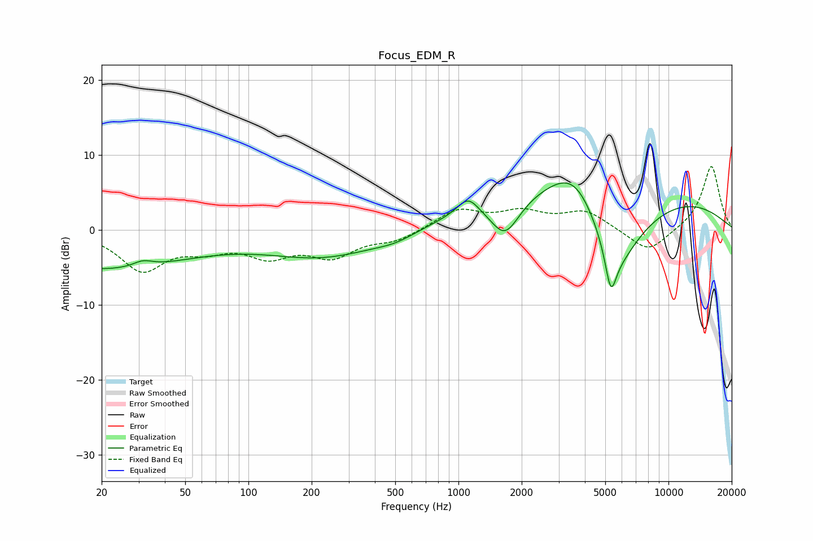

# Focus_EDM_R
See [usage instructions](https://github.com/jaakkopasanen/AutoEq#usage) for more options and info.

### Parametric EQs
Apply preamp of -6.4 dB when using parametric equalizer.

|   # | Type    |   Fc (Hz) |    Q |   Gain (dB) |
|-----|---------|-----------|------|-------------|
|   1 | Peaking |        20 | 0.34 |        -5.1 |
|   2 | Peaking |        31 | 3.11 |         0.8 |
|   3 | Peaking |       231 | 0.51 |        -3.5 |
|   4 | Peaking |       505 | 1.4  |        -0.9 |
|   5 | Peaking |      1110 | 2.85 |         2.3 |
|   6 | Peaking |      1667 | 2.01 |        -5.1 |
|   7 | Peaking |      3607 | 1.12 |         6   |
|   8 | Peaking |      4980 | 0.2  |         6.7 |
|   9 | Peaking |      5316 | 5.34 |        -5.3 |
|  10 | Peaking |      5585 | 0.99 |       -12.1 |

### Fixed Band EQs
When using fixed band (also called graphic) equalizer, apply preamp of **-8.6 dB** (if available) and set gains manually with these parameters.

|   # | Type    |   Fc (Hz) |    Q |   Gain (dB) |
|-----|---------|-----------|------|-------------|
|   1 | Peaking |        31 | 1.41 |        -5.1 |
|   2 | Peaking |        62 | 1.41 |        -2   |
|   3 | Peaking |       125 | 1.41 |        -3   |
|   4 | Peaking |       250 | 1.41 |        -3.2 |
|   5 | Peaking |       500 | 1.41 |        -1.3 |
|   6 | Peaking |      1000 | 1.41 |         2.7 |
|   7 | Peaking |      2000 | 1.41 |         2.1 |
|   8 | Peaking |      4000 | 1.41 |         2.4 |
|   9 | Peaking |      8000 | 1.41 |        -3.2 |
|  10 | Peaking |     16000 | 1.41 |         8.7 |

### Graphs

