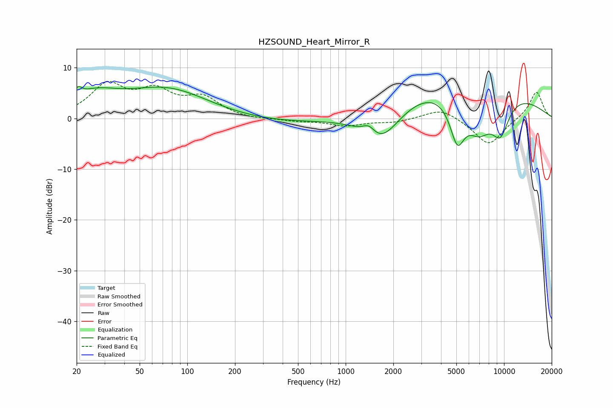

# HZSOUND_Heart_Mirror_R
See [usage instructions](https://github.com/jaakkopasanen/AutoEq#usage) for more options and info.

### Parametric EQs
Apply preamp of -6.4 dB when using parametric equalizer.

|   # | Type    |   Fc (Hz) |    Q |   Gain (dB) |
|-----|---------|-----------|------|-------------|
|   1 | Peaking |        20 | 5.93 |         1.8 |
|   2 | Peaking |        26 | 0.97 |         3.6 |
|   3 | Peaking |        76 | 0.5  |         6.6 |
|   4 | Peaking |       233 | 0.2  |        -1.4 |
|   5 | Peaking |      1403 | 3.35 |         2.1 |
|   6 | Peaking |      1653 | 1.05 |        -8.4 |
|   7 | Peaking |      5072 | 2.79 |        -8.7 |
|   8 | Peaking |      5239 | 0.27 |         8.9 |
|   9 | Peaking |      6940 | 1.45 |        -8   |
|  10 | Peaking |      9481 | 2.12 |        -7.1 |

### Fixed Band EQs
When using fixed band (also called graphic) equalizer, apply preamp of **-7.4 dB** (if available) and set gains manually with these parameters.

|   # | Type    |   Fc (Hz) |    Q |   Gain (dB) |
|-----|---------|-----------|------|-------------|
|   1 | Peaking |        31 | 1.41 |         6.3 |
|   2 | Peaking |        62 | 1.41 |         4.7 |
|   3 | Peaking |       125 | 1.41 |         3.7 |
|   4 | Peaking |       250 | 1.41 |        -0.3 |
|   5 | Peaking |       500 | 1.41 |        -0.5 |
|   6 | Peaking |      1000 | 1.41 |        -1.4 |
|   7 | Peaking |      2000 | 1.41 |        -0.7 |
|   8 | Peaking |      4000 | 1.41 |         2.1 |
|   9 | Peaking |      8000 | 1.41 |        -5.3 |
|  10 | Peaking |     16000 | 1.41 |         5.4 |

### Graphs

