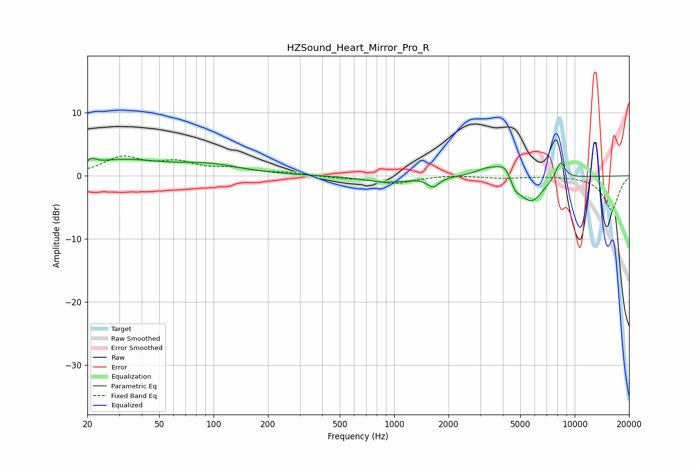

# HZSound_Heart_Mirror_Pro_R
See [usage instructions](https://github.com/jaakkopasanen/AutoEq#usage) for more options and info.

### Parametric EQs
Apply preamp of -2.9 dB when using parametric equalizer.

|   # | Type    |   Fc (Hz) |    Q |   Gain (dB) |
|-----|---------|-----------|------|-------------|
|   1 | Peaking |        21 | 5.9  |         0.8 |
|   2 | Peaking |        30 | 0.67 |         2.3 |
|   3 | Peaking |        94 | 0.76 |         1.5 |
|   4 | Peaking |       902 | 1.21 |        -1   |
|   5 | Peaking |      1644 | 4.42 |        -1.5 |
|   6 | Peaking |      3291 | 2.14 |         1.2 |
|   7 | Peaking |      4202 | 2.75 |         2.9 |
|   8 | Peaking |      4643 | 4.56 |        -2.2 |
|   9 | Peaking |      5705 | 1.97 |        -4.5 |
|  10 | Peaking |      8331 | 4.82 |         2.9 |

### Fixed Band EQs
When using fixed band (also called graphic) equalizer, apply preamp of **-3.3 dB** (if available) and set gains manually with these parameters.

|   # | Type    |   Fc (Hz) |    Q |   Gain (dB) |
|-----|---------|-----------|------|-------------|
|   1 | Peaking |        31 | 1.41 |         2.8 |
|   2 | Peaking |        62 | 1.41 |         1.8 |
|   3 | Peaking |       125 | 1.41 |         1   |
|   4 | Peaking |       250 | 1.41 |         0.4 |
|   5 | Peaking |       500 | 1.41 |        -0.3 |
|   6 | Peaking |      1000 | 1.41 |        -1.2 |
|   7 | Peaking |      2000 | 1.41 |         0.2 |
|   8 | Peaking |      4000 | 1.41 |        -0.3 |
|   9 | Peaking |      8000 | 1.41 |         0   |
|  10 | Peaking |     16000 | 1.41 |        -5.4 |

### Graphs

