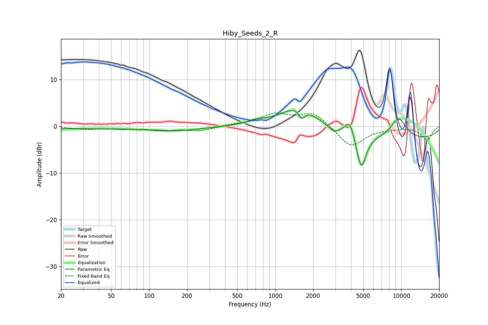

# Hiby_Seeds_2_R
See [usage instructions](https://github.com/jaakkopasanen/AutoEq#usage) for more options and info.

### Parametric EQs
Apply preamp of -3.4 dB when using parametric equalizer.

|   # | Type    |   Fc (Hz) |    Q |   Gain (dB) |
|-----|---------|-----------|------|-------------|
|   1 | Peaking |        31 | 0.18 |        -0.5 |
|   2 | Peaking |       172 | 0.77 |        -0.7 |
|   3 | Peaking |       698 | 2.18 |         0.7 |
|   4 | Peaking |      1547 | 0.97 |         4.6 |
|   5 | Peaking |      1628 | 5.86 |        -2   |
|   6 | Peaking |      2911 | 3.71 |        -1   |
|   7 | Peaking |      3905 | 3.82 |         3.6 |
|   8 | Peaking |      4817 | 3.62 |        -7.6 |
|   9 | Peaking |      9524 | 1.97 |         4.5 |
|  10 | Peaking |     10000 | 0.21 |        -2.9 |

### Fixed Band EQs
When using fixed band (also called graphic) equalizer, apply preamp of **-2.9 dB** (if available) and set gains manually with these parameters.

|   # | Type    |   Fc (Hz) |    Q |   Gain (dB) |
|-----|---------|-----------|------|-------------|
|   1 | Peaking |        31 | 1.41 |        -0.6 |
|   2 | Peaking |        62 | 1.41 |        -0.4 |
|   3 | Peaking |       125 | 1.41 |        -0.8 |
|   4 | Peaking |       250 | 1.41 |        -1   |
|   5 | Peaking |       500 | 1.41 |         0.3 |
|   6 | Peaking |      1000 | 1.41 |         2.4 |
|   7 | Peaking |      2000 | 1.41 |         3   |
|   8 | Peaking |      4000 | 1.41 |        -4.5 |
|   9 | Peaking |      8000 | 1.41 |        -0.3 |
|  10 | Peaking |     16000 | 1.41 |        -2.9 |

### Graphs

