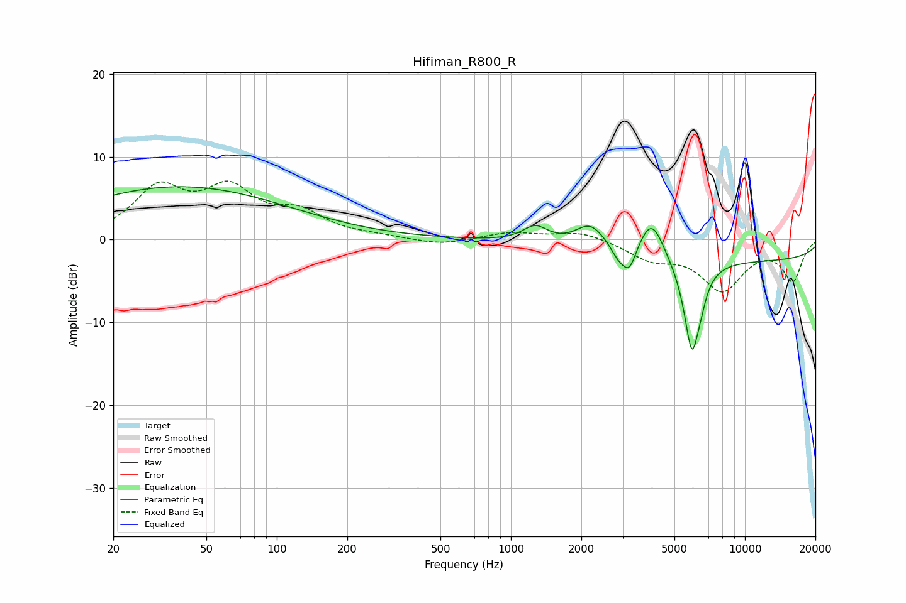

# Hifiman_R800_R
See [usage instructions](https://github.com/jaakkopasanen/AutoEq#usage) for more options and info.

### Parametric EQs
Apply preamp of -6.5 dB when using parametric equalizer.

|   # | Type    |   Fc (Hz) |    Q |   Gain (dB) |
|-----|---------|-----------|------|-------------|
|   1 | Peaking |        39 | 0.3  |         6.4 |
|   2 | Peaking |      1270 | 2.69 |         1.9 |
|   3 | Peaking |      2188 | 2.24 |         2.8 |
|   4 | Peaking |      2894 | 4.19 |        -1.6 |
|   5 | Peaking |      3209 | 4.92 |        -2.8 |
|   6 | Peaking |      3842 | 2.88 |         0   |
|   7 | Peaking |      3998 | 2.67 |         4.7 |
|   8 | Peaking |      5936 | 3.94 |       -11.2 |
|   9 | Peaking |      6485 | 6    |        -1.2 |
|  10 | Peaking |     10000 | 0.18 |        -2.5 |

### Fixed Band EQs
When using fixed band (also called graphic) equalizer, apply preamp of **-7.2 dB** (if available) and set gains manually with these parameters.

|   # | Type    |   Fc (Hz) |    Q |   Gain (dB) |
|-----|---------|-----------|------|-------------|
|   1 | Peaking |        31 | 1.41 |         5.8 |
|   2 | Peaking |        62 | 1.41 |         5.4 |
|   3 | Peaking |       125 | 1.41 |         2.8 |
|   4 | Peaking |       250 | 1.41 |         0.3 |
|   5 | Peaking |       500 | 1.41 |        -0.7 |
|   6 | Peaking |      1000 | 1.41 |         0.9 |
|   7 | Peaking |      2000 | 1.41 |         1.1 |
|   8 | Peaking |      4000 | 1.41 |        -2.1 |
|   9 | Peaking |      8000 | 1.41 |        -5.8 |
|  10 | Peaking |     16000 | 1.41 |        -4.8 |

### Graphs

