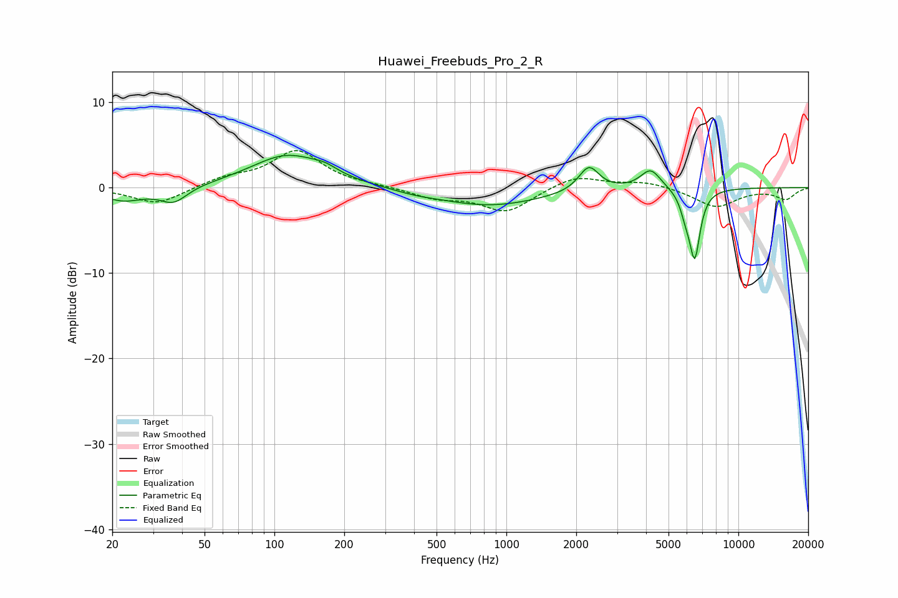

# Huawei_Freebuds_Pro_2_R
See [usage instructions](https://github.com/jaakkopasanen/AutoEq#usage) for more options and info.

### Parametric EQs
Apply preamp of -3.9 dB when using parametric equalizer.

|   # | Type    |   Fc (Hz) |    Q |   Gain (dB) |
|-----|---------|-----------|------|-------------|
|   1 | Peaking |        22 | 1.59 |        -1.5 |
|   2 | Peaking |        37 | 2.42 |        -1.8 |
|   3 | Peaking |       114 | 0.9  |         3.8 |
|   4 | Peaking |       165 | 2.71 |         0.6 |
|   5 | Peaking |       404 | 1.52 |        -0.3 |
|   6 | Peaking |       846 | 0.63 |        -2.1 |
|   7 | Peaking |      2268 | 3.23 |         2.9 |
|   8 | Peaking |      4186 | 3.19 |         2.3 |
|   9 | Peaking |      5929 | 6    |        -1.8 |
|  10 | Peaking |      6486 | 5.88 |        -7.8 |

### Fixed Band EQs
When using fixed band (also called graphic) equalizer, apply preamp of **-4.4 dB** (if available) and set gains manually with these parameters.

|   # | Type    |   Fc (Hz) |    Q |   Gain (dB) |
|-----|---------|-----------|------|-------------|
|   1 | Peaking |        31 | 1.41 |        -2   |
|   2 | Peaking |        62 | 1.41 |         1   |
|   3 | Peaking |       125 | 1.41 |         4.2 |
|   4 | Peaking |       250 | 1.41 |         0.2 |
|   5 | Peaking |       500 | 1.41 |        -1.1 |
|   6 | Peaking |      1000 | 1.41 |        -2.8 |
|   7 | Peaking |      2000 | 1.41 |         1.5 |
|   8 | Peaking |      4000 | 1.41 |         0.7 |
|   9 | Peaking |      8000 | 1.41 |        -2.2 |
|  10 | Peaking |     16000 | 1.41 |        -1.3 |

### Graphs

