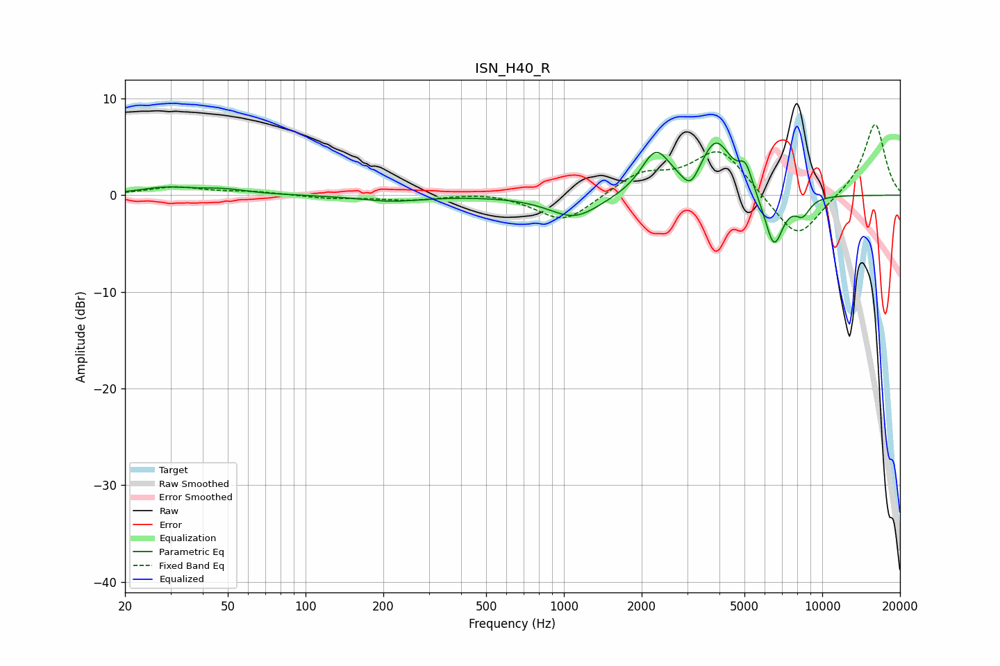

# ISN_H40_R
See [usage instructions](https://github.com/jaakkopasanen/AutoEq#usage) for more options and info.

### Parametric EQs
Apply preamp of -5.5 dB when using parametric equalizer.

|   # | Type    |   Fc (Hz) |    Q |   Gain (dB) |
|-----|---------|-----------|------|-------------|
|   1 | Peaking |        29 | 1.43 |         0.7 |
|   2 | Peaking |        48 | 1.47 |         0.5 |
|   3 | Peaking |       214 | 1.18 |        -0.6 |
|   4 | Peaking |      1100 | 1.43 |        -2.4 |
|   5 | Peaking |      2267 | 2.49 |         4.4 |
|   6 | Peaking |      3096 | 4.28 |        -2   |
|   7 | Peaking |      3878 | 2.28 |         5.5 |
|   8 | Peaking |      5056 | 5.49 |         2.3 |
|   9 | Peaking |      6499 | 3.7  |        -5.6 |
|  10 | Peaking |      8392 | 4.38 |        -1.7 |

### Fixed Band EQs
When using fixed band (also called graphic) equalizer, apply preamp of **-7.4 dB** (if available) and set gains manually with these parameters.

|   # | Type    |   Fc (Hz) |    Q |   Gain (dB) |
|-----|---------|-----------|------|-------------|
|   1 | Peaking |        31 | 1.41 |         0.8 |
|   2 | Peaking |        62 | 1.41 |         0.3 |
|   3 | Peaking |       125 | 1.41 |        -0.3 |
|   4 | Peaking |       250 | 1.41 |        -0.5 |
|   5 | Peaking |       500 | 1.41 |         0.4 |
|   6 | Peaking |      1000 | 1.41 |        -2.9 |
|   7 | Peaking |      2000 | 1.41 |         2.2 |
|   8 | Peaking |      4000 | 1.41 |         4.8 |
|   9 | Peaking |      8000 | 1.41 |        -4.8 |
|  10 | Peaking |     16000 | 1.41 |         7.6 |

### Graphs

