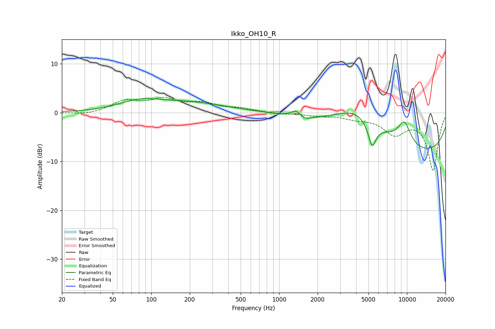

# Ikko_OH10_R
See [usage instructions](https://github.com/jaakkopasanen/AutoEq#usage) for more options and info.

### Parametric EQs
Apply preamp of -3.0 dB when using parametric equalizer.

|   # | Type    |   Fc (Hz) |    Q |   Gain (dB) |
|-----|---------|-----------|------|-------------|
|   1 | Peaking |        80 | 0.9  |         1.7 |
|   2 | Peaking |       194 | 0.46 |         2   |
|   3 | Peaking |       682 | 3.46 |         0.1 |
|   4 | Peaking |      1380 | 3.48 |         1.6 |
|   5 | Peaking |      1550 | 3.01 |        -1.1 |
|   6 | Peaking |      4216 | 0.67 |         7.2 |
|   7 | Peaking |      5113 | 5    |         1.8 |
|   8 | Peaking |      5274 | 4.03 |        -7.1 |
|   9 | Peaking |      9529 | 2.4  |         4.8 |
|  10 | Peaking |     10000 | 0.19 |        -8.9 |

### Fixed Band EQs
When using fixed band (also called graphic) equalizer, apply preamp of **-3.2 dB** (if available) and set gains manually with these parameters.

|   # | Type    |   Fc (Hz) |    Q |   Gain (dB) |
|-----|---------|-----------|------|-------------|
|   1 | Peaking |        31 | 1.41 |        -0.5 |
|   2 | Peaking |        62 | 1.41 |         2.2 |
|   3 | Peaking |       125 | 1.41 |         2.4 |
|   4 | Peaking |       250 | 1.41 |         1.7 |
|   5 | Peaking |       500 | 1.41 |         0.7 |
|   6 | Peaking |      1000 | 1.41 |        -0.2 |
|   7 | Peaking |      2000 | 1.41 |        -0.5 |
|   8 | Peaking |      4000 | 1.41 |        -0.9 |
|   9 | Peaking |      8000 | 1.41 |        -4   |
|  10 | Peaking |     16000 | 1.41 |       -11.7 |

### Graphs

