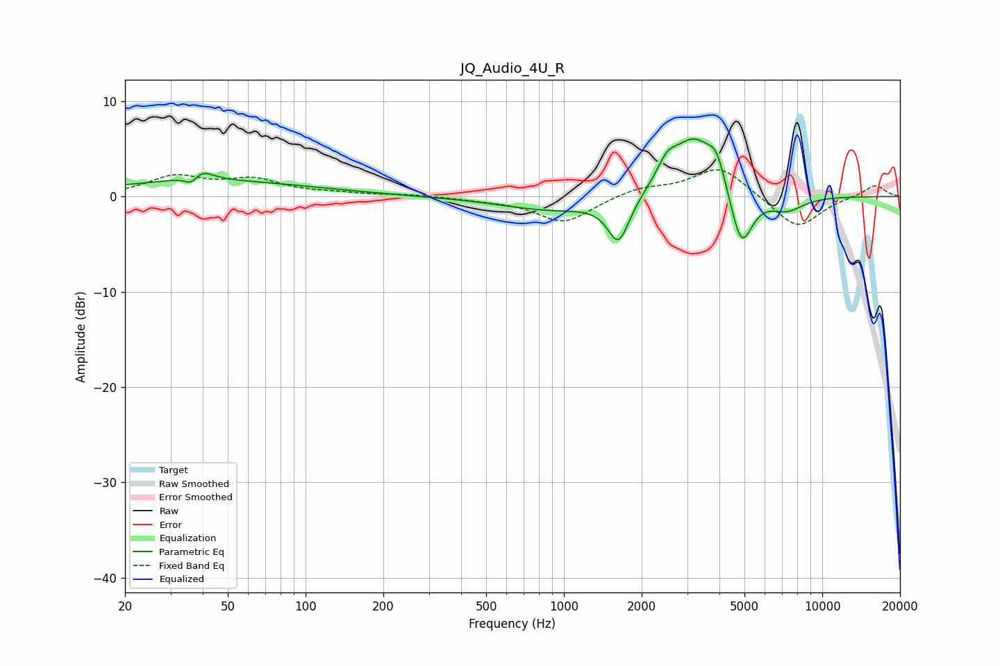

# JQ_Audio_4U_R
See [usage instructions](https://github.com/jaakkopasanen/AutoEq#usage) for more options and info.

### Parametric EQs
Apply preamp of -6.1 dB when using parametric equalizer.

|   # | Type    |   Fc (Hz) |    Q |   Gain (dB) |
|-----|---------|-----------|------|-------------|
|   1 | Peaking |        36 | 4.87 |        -1.6 |
|   2 | Peaking |        38 | 3.17 |         1.8 |
|   3 | Peaking |        43 | 0.35 |         1.6 |
|   4 | Peaking |       929 | 0.69 |        -1.5 |
|   5 | Peaking |      1628 | 3.36 |        -4.7 |
|   6 | Peaking |      2506 | 3.53 |         2.1 |
|   7 | Peaking |      3190 | 1.62 |         6.1 |
|   8 | Peaking |      3902 | 4.19 |         2.6 |
|   9 | Peaking |      4862 | 3.22 |        -6.3 |
|  10 | Peaking |      7289 | 2.03 |        -1.5 |

### Fixed Band EQs
When using fixed band (also called graphic) equalizer, apply preamp of **-2.9 dB** (if available) and set gains manually with these parameters.

|   # | Type    |   Fc (Hz) |    Q |   Gain (dB) |
|-----|---------|-----------|------|-------------|
|   1 | Peaking |        31 | 1.41 |         2   |
|   2 | Peaking |        62 | 1.41 |         1.6 |
|   3 | Peaking |       125 | 1.41 |         0.3 |
|   4 | Peaking |       250 | 1.41 |         0.2 |
|   5 | Peaking |       500 | 1.41 |        -0.3 |
|   6 | Peaking |      1000 | 1.41 |        -2.8 |
|   7 | Peaking |      2000 | 1.41 |         0.9 |
|   8 | Peaking |      4000 | 1.41 |         3.2 |
|   9 | Peaking |      8000 | 1.41 |        -3.4 |
|  10 | Peaking |     16000 | 1.41 |         1.3 |

### Graphs

