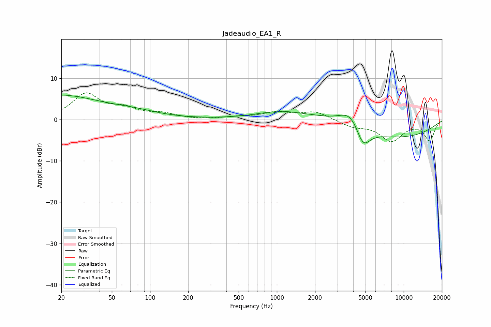

# Jadeaudio_EA1_R
See [usage instructions](https://github.com/jaakkopasanen/AutoEq#usage) for more options and info.

### Parametric EQs
Apply preamp of -6.0 dB when using parametric equalizer.

|   # | Type    |   Fc (Hz) |    Q |   Gain (dB) |
|-----|---------|-----------|------|-------------|
|   1 | Peaking |        20 | 0.46 |         5.6 |
|   2 | Peaking |        20 | 5.91 |        -3.2 |
|   3 | Peaking |        20 | 5.79 |         3.3 |
|   4 | Peaking |        74 | 0.7  |         1.3 |
|   5 | Peaking |       923 | 5.96 |        -0.5 |
|   6 | Peaking |       970 | 1.43 |         0.9 |
|   7 | Peaking |      1638 | 0.46 |         2.1 |
|   8 | Peaking |      3849 | 1.53 |         4.6 |
|   9 | Peaking |      4768 | 2.46 |        -5.5 |
|  10 | Peaking |      8043 | 0.32 |        -4.5 |

### Fixed Band EQs
When using fixed band (also called graphic) equalizer, apply preamp of **-6.6 dB** (if available) and set gains manually with these parameters.

|   # | Type    |   Fc (Hz) |    Q |   Gain (dB) |
|-----|---------|-----------|------|-------------|
|   1 | Peaking |        31 | 1.41 |         6   |
|   2 | Peaking |        62 | 1.41 |         2.2 |
|   3 | Peaking |       125 | 1.41 |         1.2 |
|   4 | Peaking |       250 | 1.41 |        -0.1 |
|   5 | Peaking |       500 | 1.41 |         0.5 |
|   6 | Peaking |      1000 | 1.41 |         1.6 |
|   7 | Peaking |      2000 | 1.41 |         1.9 |
|   8 | Peaking |      4000 | 1.41 |        -1.5 |
|   9 | Peaking |      8000 | 1.41 |        -4.9 |
|  10 | Peaking |     16000 | 1.41 |        -4.9 |

### Graphs

