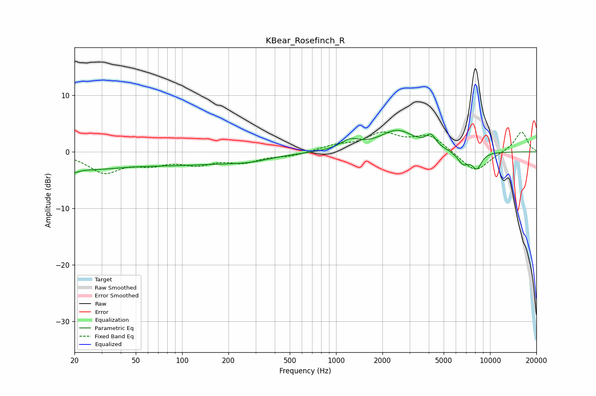

# KBear_Rosefinch_R
See [usage instructions](https://github.com/jaakkopasanen/AutoEq#usage) for more options and info.

### Parametric EQs
Apply preamp of -3.9 dB when using parametric equalizer.

|   # | Type    |   Fc (Hz) |    Q |   Gain (dB) |
|-----|---------|-----------|------|-------------|
|   1 | Peaking |        20 | 5.9  |        -0.6 |
|   2 | Peaking |        21 | 0.5  |        -2.7 |
|   3 | Peaking |       105 | 0.42 |        -1.8 |
|   4 | Peaking |       178 | 5.48 |        -0   |
|   5 | Peaking |       273 | 0.96 |        -0.9 |
|   6 | Peaking |      1237 | 2.25 |         1.6 |
|   7 | Peaking |      2494 | 1.23 |         3.7 |
|   8 | Peaking |      4136 | 4.49 |         2   |
|   9 | Peaking |      6694 | 3.52 |        -2.2 |
|  10 | Peaking |      8212 | 4.05 |        -2.7 |

### Fixed Band EQs
When using fixed band (also called graphic) equalizer, apply preamp of **-3.6 dB** (if available) and set gains manually with these parameters.

|   # | Type    |   Fc (Hz) |    Q |   Gain (dB) |
|-----|---------|-----------|------|-------------|
|   1 | Peaking |        31 | 1.41 |        -3.4 |
|   2 | Peaking |        62 | 1.41 |        -1.7 |
|   3 | Peaking |       125 | 1.41 |        -1.8 |
|   4 | Peaking |       250 | 1.41 |        -1.6 |
|   5 | Peaking |       500 | 1.41 |        -0.7 |
|   6 | Peaking |      1000 | 1.41 |         1   |
|   7 | Peaking |      2000 | 1.41 |         3   |
|   8 | Peaking |      4000 | 1.41 |         2.8 |
|   9 | Peaking |      8000 | 1.41 |        -3.7 |
|  10 | Peaking |     16000 | 1.41 |         3.7 |

### Graphs

