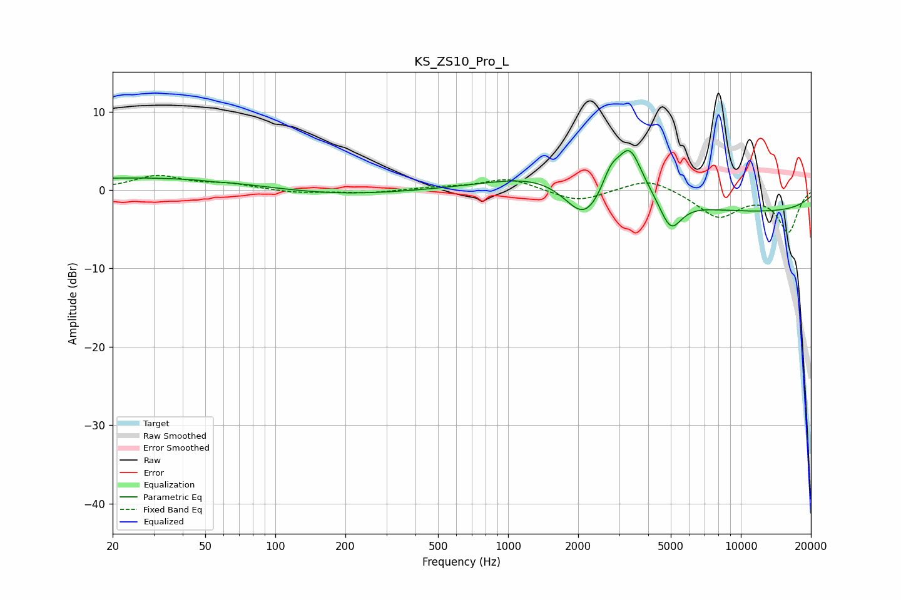

# KS_ZS10_Pro_L
See [usage instructions](https://github.com/jaakkopasanen/AutoEq#usage) for more options and info.

### Parametric EQs
Apply preamp of -5.1 dB when using parametric equalizer.

|   # | Type    |   Fc (Hz) |    Q |   Gain (dB) |
|-----|---------|-----------|------|-------------|
|   1 | Peaking |        28 | 0.27 |         1.6 |
|   2 | Peaking |        55 | 5.24 |        -0.1 |
|   3 | Peaking |       170 | 0.48 |        -0.8 |
|   4 | Peaking |      1582 | 0.6  |         2.9 |
|   5 | Peaking |      2121 | 1.64 |        -5.1 |
|   6 | Peaking |      2758 | 3.76 |         2.6 |
|   7 | Peaking |      3327 | 2.59 |         6.2 |
|   8 | Peaking |      4443 | 0.96 |         0.9 |
|   9 | Peaking |      4996 | 2.91 |        -4.2 |
|  10 | Peaking |      9557 | 0.19 |        -2.9 |

### Fixed Band EQs
When using fixed band (also called graphic) equalizer, apply preamp of **-2.0 dB** (if available) and set gains manually with these parameters.

|   # | Type    |   Fc (Hz) |    Q |   Gain (dB) |
|-----|---------|-----------|------|-------------|
|   1 | Peaking |        31 | 1.41 |         1.8 |
|   2 | Peaking |        62 | 1.41 |         0.7 |
|   3 | Peaking |       125 | 1.41 |        -0.4 |
|   4 | Peaking |       250 | 1.41 |        -0.4 |
|   5 | Peaking |       500 | 1.41 |         0.3 |
|   6 | Peaking |      1000 | 1.41 |         1.5 |
|   7 | Peaking |      2000 | 1.41 |        -1.6 |
|   8 | Peaking |      4000 | 1.41 |         1.7 |
|   9 | Peaking |      8000 | 1.41 |        -3.4 |
|  10 | Peaking |     16000 | 1.41 |        -5.3 |

### Graphs

