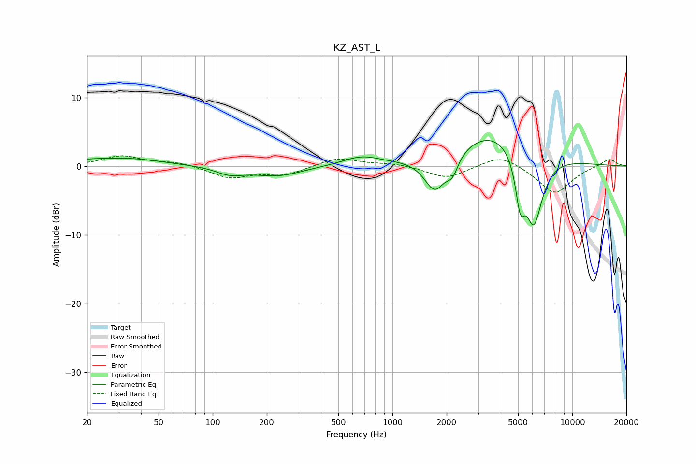

# KZ_AST_L
See [usage instructions](https://github.com/jaakkopasanen/AutoEq#usage) for more options and info.

### Parametric EQs
Apply preamp of -3.8 dB when using parametric equalizer.

|   # | Type    |   Fc (Hz) |    Q |   Gain (dB) |
|-----|---------|-----------|------|-------------|
|   1 | Peaking |        20 | 1.77 |         0.3 |
|   2 | Peaking |        32 | 0.7  |         1.1 |
|   3 | Peaking |       124 | 1.89 |        -1   |
|   4 | Peaking |       229 | 1.02 |        -1.4 |
|   5 | Peaking |       672 | 1.35 |         1.3 |
|   6 | Peaking |      1724 | 2.33 |        -5.3 |
|   7 | Peaking |      2155 | 4.32 |        -2.4 |
|   8 | Peaking |      3809 | 0.62 |         5.7 |
|   9 | Peaking |      5136 | 5.32 |        -6.2 |
|  10 | Peaking |      6106 | 2.6  |       -11.1 |

### Fixed Band EQs
When using fixed band (also called graphic) equalizer, apply preamp of **-1.6 dB** (if available) and set gains manually with these parameters.

|   # | Type    |   Fc (Hz) |    Q |   Gain (dB) |
|-----|---------|-----------|------|-------------|
|   1 | Peaking |        31 | 1.41 |         1.5 |
|   2 | Peaking |        62 | 1.41 |         0.6 |
|   3 | Peaking |       125 | 1.41 |        -1.7 |
|   4 | Peaking |       250 | 1.41 |        -1.2 |
|   5 | Peaking |       500 | 1.41 |         1.3 |
|   6 | Peaking |      1000 | 1.41 |         0.4 |
|   7 | Peaking |      2000 | 1.41 |        -1.8 |
|   8 | Peaking |      4000 | 1.41 |         1.8 |
|   9 | Peaking |      8000 | 1.41 |        -4   |
|  10 | Peaking |     16000 | 1.41 |         1.1 |

### Graphs

