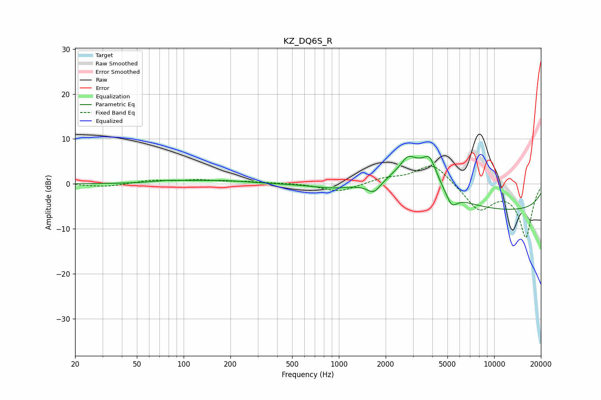

# KZ_DQ6S_R
See [usage instructions](https://github.com/jaakkopasanen/AutoEq#usage) for more options and info.

### Parametric EQs
Apply preamp of -6.2 dB when using parametric equalizer.

|   # | Type    |   Fc (Hz) |    Q |   Gain (dB) |
|-----|---------|-----------|------|-------------|
|   1 | Peaking |        81 | 1.28 |         0.5 |
|   2 | Peaking |       180 | 0.77 |         0.7 |
|   3 | Peaking |       279 | 1    |        -0.1 |
|   4 | Peaking |       907 | 1.08 |        -0.8 |
|   5 | Peaking |      1679 | 3.3  |        -2.5 |
|   6 | Peaking |      2770 | 3.58 |         2.1 |
|   7 | Peaking |      3098 | 0.94 |         8   |
|   8 | Peaking |      3844 | 3.49 |         4.2 |
|   9 | Peaking |      5323 | 3.88 |        -3.1 |
|  10 | Peaking |     10000 | 0.18 |        -6.1 |

### Fixed Band EQs
When using fixed band (also called graphic) equalizer, apply preamp of **-4.0 dB** (if available) and set gains manually with these parameters.

|   # | Type    |   Fc (Hz) |    Q |   Gain (dB) |
|-----|---------|-----------|------|-------------|
|   1 | Peaking |        31 | 1.41 |        -0.7 |
|   2 | Peaking |        62 | 1.41 |         0.7 |
|   3 | Peaking |       125 | 1.41 |         0.8 |
|   4 | Peaking |       250 | 1.41 |         0.4 |
|   5 | Peaking |       500 | 1.41 |         0.1 |
|   6 | Peaking |      1000 | 1.41 |        -1.9 |
|   7 | Peaking |      2000 | 1.41 |         1.1 |
|   8 | Peaking |      4000 | 1.41 |         4.8 |
|   9 | Peaking |      8000 | 1.41 |        -5.7 |
|  10 | Peaking |     16000 | 1.41 |       -11.7 |

### Graphs

