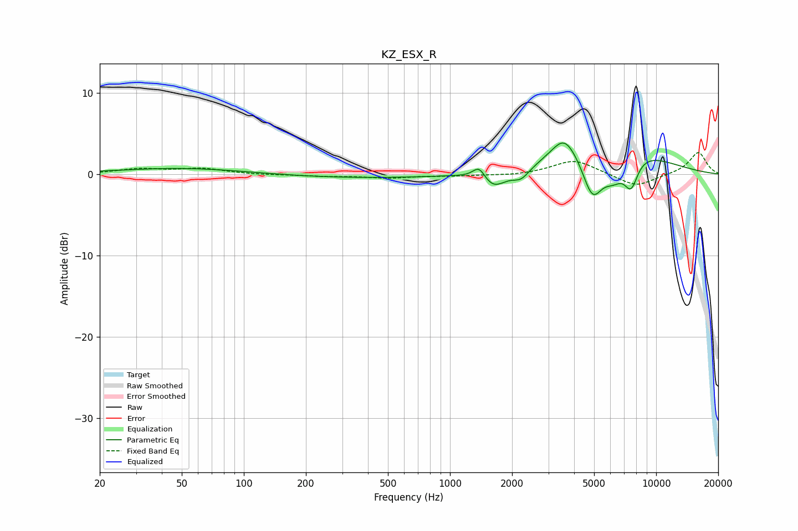

# KZ_ESX_R
See [usage instructions](https://github.com/jaakkopasanen/AutoEq#usage) for more options and info.

### Parametric EQs
Apply preamp of -3.9 dB when using parametric equalizer.

|   # | Type    |   Fc (Hz) |    Q |   Gain (dB) |
|-----|---------|-----------|------|-------------|
|   1 | Peaking |       140 | 0.21 |         1.5 |
|   2 | Peaking |       259 | 0.32 |        -1.7 |
|   3 | Peaking |      1385 | 4.63 |         1.6 |
|   4 | Peaking |      1621 | 2.36 |        -2.1 |
|   5 | Peaking |      2214 | 3.35 |        -1.3 |
|   6 | Peaking |      3581 | 2.35 |         2.8 |
|   7 | Peaking |      4909 | 2.7  |        -5.7 |
|   8 | Peaking |      5960 | 0.61 |         4.5 |
|   9 | Peaking |      6199 | 2.31 |        -3.3 |
|  10 | Peaking |      7555 | 3.87 |        -3.7 |

### Fixed Band EQs
When using fixed band (also called graphic) equalizer, apply preamp of **-2.7 dB** (if available) and set gains manually with these parameters.

|   # | Type    |   Fc (Hz) |    Q |   Gain (dB) |
|-----|---------|-----------|------|-------------|
|   1 | Peaking |        31 | 1.41 |         0.6 |
|   2 | Peaking |        62 | 1.41 |         0.7 |
|   3 | Peaking |       125 | 1.41 |        -0.1 |
|   4 | Peaking |       250 | 1.41 |        -0.2 |
|   5 | Peaking |       500 | 1.41 |        -0.4 |
|   6 | Peaking |      1000 | 1.41 |        -0.2 |
|   7 | Peaking |      2000 | 1.41 |        -0.2 |
|   8 | Peaking |      4000 | 1.41 |         1.8 |
|   9 | Peaking |      8000 | 1.41 |        -1.6 |
|  10 | Peaking |     16000 | 1.41 |         2.7 |

### Graphs

