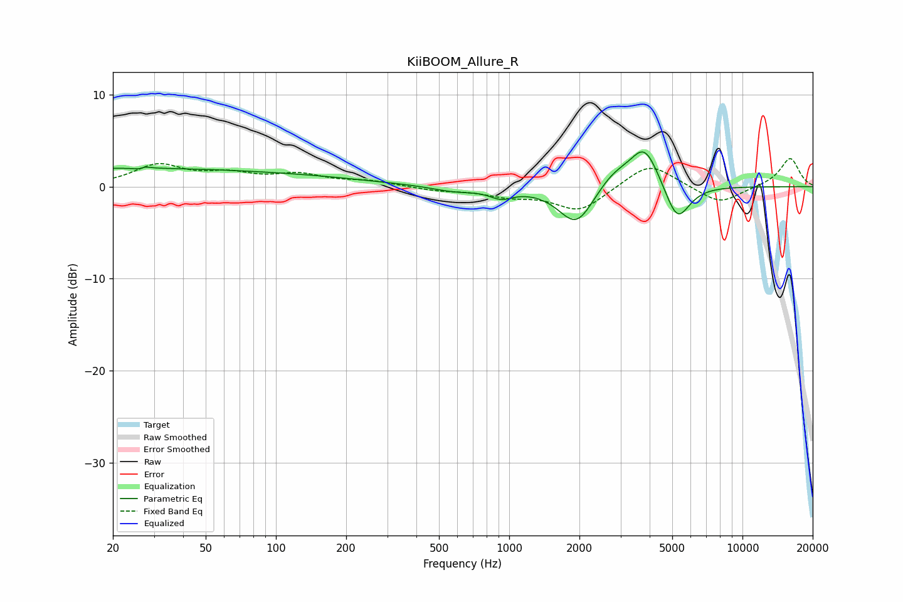

# KiiBOOM_Allure_R
See [usage instructions](https://github.com/jaakkopasanen/AutoEq#usage) for more options and info.

### Parametric EQs
Apply preamp of -3.9 dB when using parametric equalizer.

|   # | Type    |   Fc (Hz) |    Q |   Gain (dB) |
|-----|---------|-----------|------|-------------|
|   1 | Peaking |        20 | 0.21 |         1.9 |
|   2 | Peaking |        27 | 6    |        -2   |
|   3 | Peaking |        27 | 5.99 |         2   |
|   4 | Peaking |       152 | 0.51 |         0.6 |
|   5 | Peaking |       578 | 1.49 |        -0.6 |
|   6 | Peaking |       924 | 2.8  |        -1   |
|   7 | Peaking |      1942 | 1.87 |        -4.3 |
|   8 | Peaking |      2791 | 1.86 |         1.7 |
|   9 | Peaking |      3808 | 2.23 |         4.5 |
|  10 | Peaking |      5251 | 2.63 |        -4.2 |

### Fixed Band EQs
When using fixed band (also called graphic) equalizer, apply preamp of **-3.1 dB** (if available) and set gains manually with these parameters.

|   # | Type    |   Fc (Hz) |    Q |   Gain (dB) |
|-----|---------|-----------|------|-------------|
|   1 | Peaking |        31 | 1.41 |         2.2 |
|   2 | Peaking |        62 | 1.41 |         1.2 |
|   3 | Peaking |       125 | 1.41 |         1.2 |
|   4 | Peaking |       250 | 1.41 |         0.5 |
|   5 | Peaking |       500 | 1.41 |        -0.4 |
|   6 | Peaking |      1000 | 1.41 |        -0.9 |
|   7 | Peaking |      2000 | 1.41 |        -2.7 |
|   8 | Peaking |      4000 | 1.41 |         2.7 |
|   9 | Peaking |      8000 | 1.41 |        -1.9 |
|  10 | Peaking |     16000 | 1.41 |         3.1 |

### Graphs

