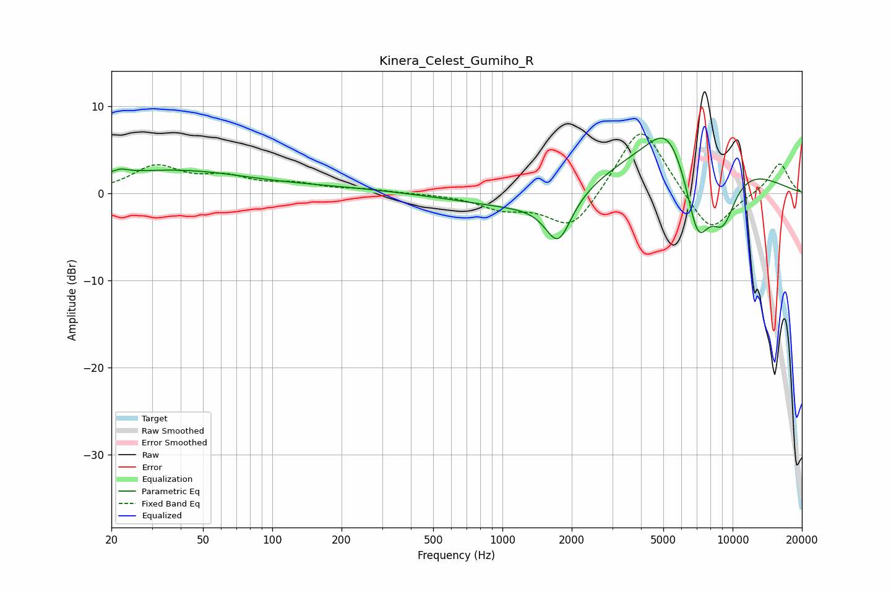

# Kinera_Celest_Gumiho_R
See [usage instructions](https://github.com/jaakkopasanen/AutoEq#usage) for more options and info.

### Parametric EQs
Apply preamp of -6.4 dB when using parametric equalizer.

|   # | Type    |   Fc (Hz) |    Q |   Gain (dB) |
|-----|---------|-----------|------|-------------|
|   1 | Peaking |        21 | 5.14 |        -1.8 |
|   2 | Peaking |        21 | 4.22 |         2.4 |
|   3 | Peaking |        37 | 0.42 |         2.6 |
|   4 | Peaking |       200 | 0.56 |         0.5 |
|   5 | Peaking |      1413 | 0.52 |        -2.3 |
|   6 | Peaking |      1748 | 2.49 |        -5.3 |
|   7 | Peaking |      5228 | 1.77 |         3.6 |
|   8 | Peaking |      5922 | 0.41 |         6.6 |
|   9 | Peaking |      7059 | 2.32 |        -9.3 |
|  10 | Peaking |      9074 | 2.05 |        -6.4 |

### Fixed Band EQs
When using fixed band (also called graphic) equalizer, apply preamp of **-6.9 dB** (if available) and set gains manually with these parameters.

|   # | Type    |   Fc (Hz) |    Q |   Gain (dB) |
|-----|---------|-----------|------|-------------|
|   1 | Peaking |        31 | 1.41 |         3   |
|   2 | Peaking |        62 | 1.41 |         1.6 |
|   3 | Peaking |       125 | 1.41 |         0.9 |
|   4 | Peaking |       250 | 1.41 |         0.4 |
|   5 | Peaking |       500 | 1.41 |        -0   |
|   6 | Peaking |      1000 | 1.41 |        -1.6 |
|   7 | Peaking |      2000 | 1.41 |        -4.4 |
|   8 | Peaking |      4000 | 1.41 |         8.3 |
|   9 | Peaking |      8000 | 1.41 |        -4.9 |
|  10 | Peaking |     16000 | 1.41 |         3.6 |

### Graphs

