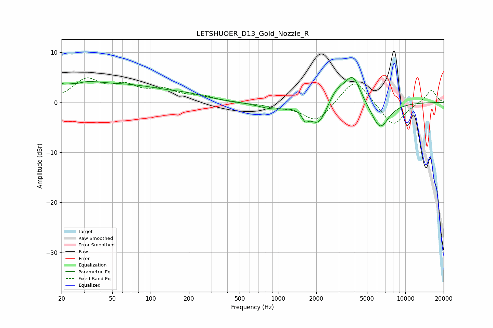

# LETSHUOER_D13_Gold_Nozzle_R
See [usage instructions](https://github.com/jaakkopasanen/AutoEq#usage) for more options and info.

### Parametric EQs
Apply preamp of -5.1 dB when using parametric equalizer.

|   # | Type    |   Fc (Hz) |    Q |   Gain (dB) |
|-----|---------|-----------|------|-------------|
|   1 | Peaking |        24 | 0.8  |         3.8 |
|   2 | Peaking |        26 | 2.45 |        -1.1 |
|   3 | Peaking |        72 | 0.5  |         2.8 |
|   4 | Peaking |       196 | 0.99 |         0.8 |
|   5 | Peaking |       902 | 1.25 |        -1.2 |
|   6 | Peaking |      1633 | 5.67 |        -1.8 |
|   7 | Peaking |      2079 | 2.03 |        -4.8 |
|   8 | Peaking |      2892 | 1.98 |         2.9 |
|   9 | Peaking |      3874 | 2.32 |         5.3 |
|  10 | Peaking |      6324 | 1.96 |        -5.4 |

### Fixed Band EQs
When using fixed band (also called graphic) equalizer, apply preamp of **-5.0 dB** (if available) and set gains manually with these parameters.

|   # | Type    |   Fc (Hz) |    Q |   Gain (dB) |
|-----|---------|-----------|------|-------------|
|   1 | Peaking |        31 | 1.41 |         4.3 |
|   2 | Peaking |        62 | 1.41 |         2.8 |
|   3 | Peaking |       125 | 1.41 |         2.1 |
|   4 | Peaking |       250 | 1.41 |         1.1 |
|   5 | Peaking |       500 | 1.41 |        -0.2 |
|   6 | Peaking |      1000 | 1.41 |        -0.7 |
|   7 | Peaking |      2000 | 1.41 |        -3.9 |
|   8 | Peaking |      4000 | 1.41 |         5.1 |
|   9 | Peaking |      8000 | 1.41 |        -4.9 |
|  10 | Peaking |     16000 | 1.41 |         2.6 |

### Graphs

