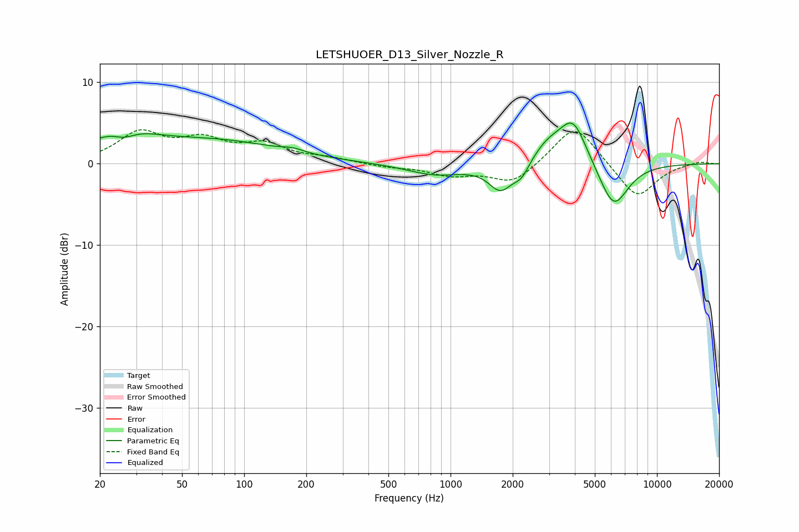

# LETSHUOER_D13_Silver_Nozzle_R
See [usage instructions](https://github.com/jaakkopasanen/AutoEq#usage) for more options and info.

### Parametric EQs
Apply preamp of -5.1 dB when using parametric equalizer.

|   # | Type    |   Fc (Hz) |    Q |   Gain (dB) |
|-----|---------|-----------|------|-------------|
|   1 | Peaking |        25 | 0.99 |         3.4 |
|   2 | Peaking |        26 | 2.4  |        -1.4 |
|   3 | Peaking |        73 | 0.43 |         2.6 |
|   4 | Peaking |       172 | 2.85 |         0.4 |
|   5 | Peaking |       845 | 1.04 |        -1.4 |
|   6 | Peaking |      1748 | 2.45 |        -3.2 |
|   7 | Peaking |      2204 | 3.64 |        -1.7 |
|   8 | Peaking |      2968 | 1.77 |         2.2 |
|   9 | Peaking |      3929 | 2.1  |         5.3 |
|  10 | Peaking |      6164 | 1.93 |        -5.7 |

### Fixed Band EQs
When using fixed band (also called graphic) equalizer, apply preamp of **-4.3 dB** (if available) and set gains manually with these parameters.

|   # | Type    |   Fc (Hz) |    Q |   Gain (dB) |
|-----|---------|-----------|------|-------------|
|   1 | Peaking |        31 | 1.41 |         3.6 |
|   2 | Peaking |        62 | 1.41 |         2.5 |
|   3 | Peaking |       125 | 1.41 |         2.1 |
|   4 | Peaking |       250 | 1.41 |         0.6 |
|   5 | Peaking |       500 | 1.41 |        -0.4 |
|   6 | Peaking |      1000 | 1.41 |        -1.3 |
|   7 | Peaking |      2000 | 1.41 |        -2.5 |
|   8 | Peaking |      4000 | 1.41 |         5   |
|   9 | Peaking |      8000 | 1.41 |        -4.4 |
|  10 | Peaking |     16000 | 1.41 |         0.3 |

### Graphs

