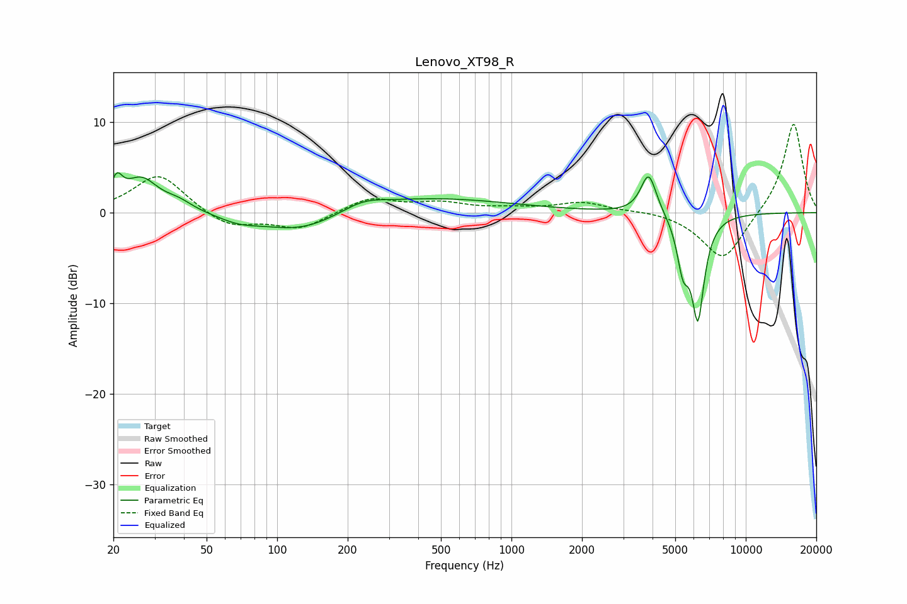

# Lenovo_XT98_R
See [usage instructions](https://github.com/jaakkopasanen/AutoEq#usage) for more options and info.

### Parametric EQs
Apply preamp of -4.5 dB when using parametric equalizer.

|   # | Type    |   Fc (Hz) |    Q |   Gain (dB) |
|-----|---------|-----------|------|-------------|
|   1 | Peaking |        21 | 5.92 |         2.5 |
|   2 | Peaking |        26 | 1.97 |         3.6 |
|   3 | Peaking |        38 | 2.32 |         0.9 |
|   4 | Peaking |        69 | 1.65 |        -0.8 |
|   5 | Peaking |       127 | 0.82 |        -2.4 |
|   6 | Peaking |       232 | 1.59 |         0.9 |
|   7 | Peaking |       417 | 0.39 |         1.7 |
|   8 | Peaking |      3851 | 4.2  |         4.6 |
|   9 | Peaking |      5396 | 5.49 |        -4.8 |
|  10 | Peaking |      6249 | 4.99 |       -11.1 |

### Fixed Band EQs
When using fixed band (also called graphic) equalizer, apply preamp of **-9.9 dB** (if available) and set gains manually with these parameters.

|   # | Type    |   Fc (Hz) |    Q |   Gain (dB) |
|-----|---------|-----------|------|-------------|
|   1 | Peaking |        31 | 1.41 |         4.3 |
|   2 | Peaking |        62 | 1.41 |        -1.7 |
|   3 | Peaking |       125 | 1.41 |        -1.8 |
|   4 | Peaking |       250 | 1.41 |         1.6 |
|   5 | Peaking |       500 | 1.41 |         1   |
|   6 | Peaking |      1000 | 1.41 |         0.4 |
|   7 | Peaking |      2000 | 1.41 |         1.1 |
|   8 | Peaking |      4000 | 1.41 |         0.3 |
|   9 | Peaking |      8000 | 1.41 |        -5.4 |
|  10 | Peaking |     16000 | 1.41 |        10.1 |

### Graphs

