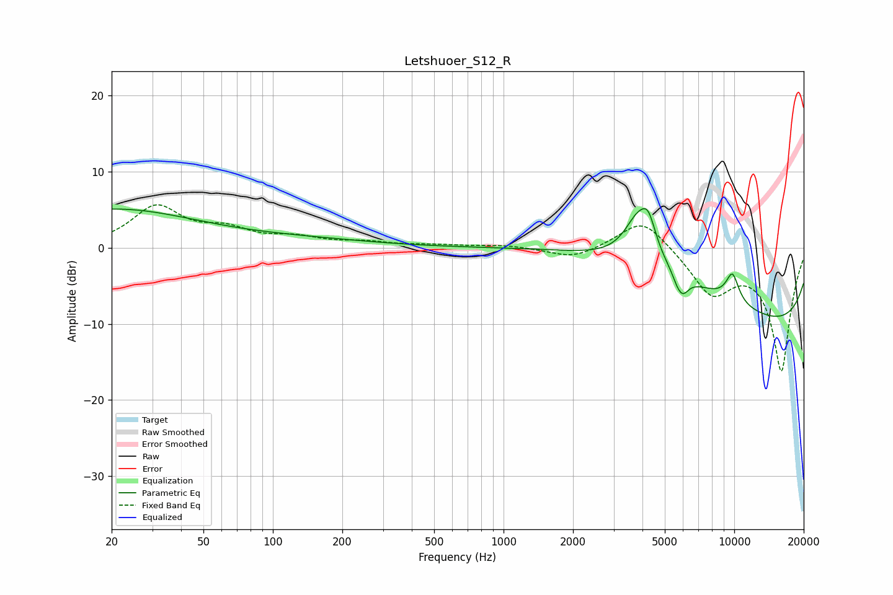

# Letshuoer_S12_R
See [usage instructions](https://github.com/jaakkopasanen/AutoEq#usage) for more options and info.

### Parametric EQs
Apply preamp of -5.2 dB when using parametric equalizer.

|   # | Type    |   Fc (Hz) |    Q |   Gain (dB) |
|-----|---------|-----------|------|-------------|
|   1 | Peaking |        20 | 0.38 |         5   |
|   2 | Peaking |       131 | 0.44 |         0.9 |
|   3 | Peaking |      3807 | 2.33 |         5.4 |
|   4 | Peaking |      4244 | 4.21 |         3.8 |
|   5 | Peaking |      5133 | 0.28 |         8.7 |
|   6 | Peaking |      5667 | 6    |        -0.9 |
|   7 | Peaking |      5980 | 5.04 |        -2.2 |
|   8 | Peaking |      9604 | 5.38 |        -0.7 |
|   9 | Peaking |      9762 | 0.18 |       -14.2 |
|  10 | Peaking |      9780 | 4.33 |         4.4 |

### Fixed Band EQs
When using fixed band (also called graphic) equalizer, apply preamp of **-5.7 dB** (if available) and set gains manually with these parameters.

|   # | Type    |   Fc (Hz) |    Q |   Gain (dB) |
|-----|---------|-----------|------|-------------|
|   1 | Peaking |        31 | 1.41 |         5.2 |
|   2 | Peaking |        62 | 1.41 |         2   |
|   3 | Peaking |       125 | 1.41 |         1.1 |
|   4 | Peaking |       250 | 1.41 |         0.6 |
|   5 | Peaking |       500 | 1.41 |         0.3 |
|   6 | Peaking |      1000 | 1.41 |         0.3 |
|   7 | Peaking |      2000 | 1.41 |        -1.5 |
|   8 | Peaking |      4000 | 1.41 |         4.2 |
|   9 | Peaking |      8000 | 1.41 |        -5.7 |
|  10 | Peaking |     16000 | 1.41 |       -16.1 |

### Graphs

