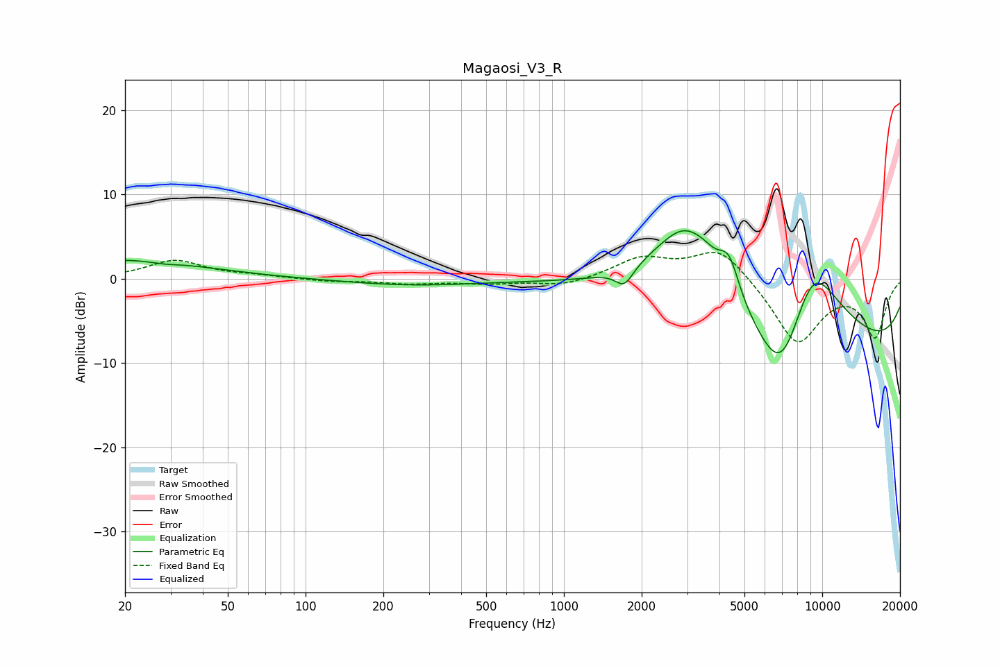

# Magaosi_V3_R
See [usage instructions](https://github.com/jaakkopasanen/AutoEq#usage) for more options and info.

### Parametric EQs
Apply preamp of -5.8 dB when using parametric equalizer.

|   # | Type    |   Fc (Hz) |    Q |   Gain (dB) |
|-----|---------|-----------|------|-------------|
|   1 | Peaking |        20 | 0.47 |         2.3 |
|   2 | Peaking |        28 | 2.64 |        -0.3 |
|   3 | Peaking |       256 | 0.55 |        -0.8 |
|   4 | Peaking |      1714 | 4.09 |        -2.1 |
|   5 | Peaking |      2995 | 0.9  |        12   |
|   6 | Peaking |      3509 | 4.03 |         0.4 |
|   7 | Peaking |      4356 | 3.5  |         4.2 |
|   8 | Peaking |      6950 | 1.12 |       -12.7 |
|   9 | Peaking |      9086 | 0.86 |        15.5 |
|  10 | Peaking |     10000 | 0.18 |       -10.4 |

### Fixed Band EQs
When using fixed band (also called graphic) equalizer, apply preamp of **-3.2 dB** (if available) and set gains manually with these parameters.

|   # | Type    |   Fc (Hz) |    Q |   Gain (dB) |
|-----|---------|-----------|------|-------------|
|   1 | Peaking |        31 | 1.41 |         2.1 |
|   2 | Peaking |        62 | 1.41 |         0.3 |
|   3 | Peaking |       125 | 1.41 |        -0.3 |
|   4 | Peaking |       250 | 1.41 |        -0.5 |
|   5 | Peaking |       500 | 1.41 |        -0.5 |
|   6 | Peaking |      1000 | 1.41 |        -0.9 |
|   7 | Peaking |      2000 | 1.41 |         2.4 |
|   8 | Peaking |      4000 | 1.41 |         3.9 |
|   9 | Peaking |      8000 | 1.41 |        -7.7 |
|  10 | Peaking |     16000 | 1.41 |        -6.7 |

### Graphs

