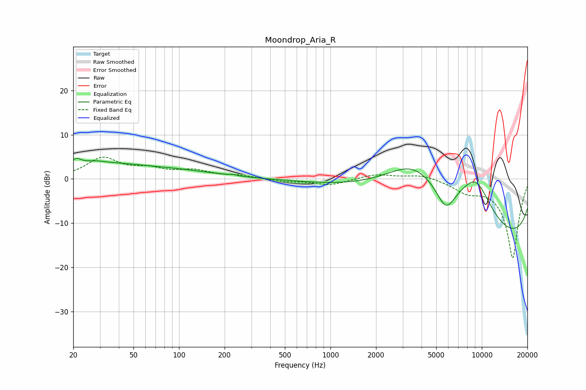

# Moondrop_Aria_R
See [usage instructions](https://github.com/jaakkopasanen/AutoEq#usage) for more options and info.

### Parametric EQs
Apply preamp of -4.8 dB when using parametric equalizer.

|   # | Type    |   Fc (Hz) |    Q |   Gain (dB) |
|-----|---------|-----------|------|-------------|
|   1 | Peaking |        21 | 6    |         0.8 |
|   2 | Peaking |        23 | 0.32 |         3.6 |
|   3 | Peaking |        30 | 2.49 |         0.7 |
|   4 | Peaking |        31 | 2.56 |        -0.5 |
|   5 | Peaking |       113 | 0.57 |         1   |
|   6 | Peaking |       226 | 5.93 |         0.2 |
|   7 | Peaking |      3542 | 0.56 |        12.7 |
|   8 | Peaking |      5785 | 2.24 |        -5.7 |
|   9 | Peaking |      9122 | 0.78 |        15.5 |
|  10 | Peaking |     10000 | 0.2  |       -20   |

### Fixed Band EQs
When using fixed band (also called graphic) equalizer, apply preamp of **-5.0 dB** (if available) and set gains manually with these parameters.

|   # | Type    |   Fc (Hz) |    Q |   Gain (dB) |
|-----|---------|-----------|------|-------------|
|   1 | Peaking |        31 | 1.41 |         4.5 |
|   2 | Peaking |        62 | 1.41 |         1.8 |
|   3 | Peaking |       125 | 1.41 |         1.7 |
|   4 | Peaking |       250 | 1.41 |         0.7 |
|   5 | Peaking |       500 | 1.41 |        -0.6 |
|   6 | Peaking |      1000 | 1.41 |        -1.4 |
|   7 | Peaking |      2000 | 1.41 |         1.1 |
|   8 | Peaking |      4000 | 1.41 |         1.1 |
|   9 | Peaking |      8000 | 1.41 |        -2.3 |
|  10 | Peaking |     16000 | 1.41 |       -17.9 |

### Graphs

