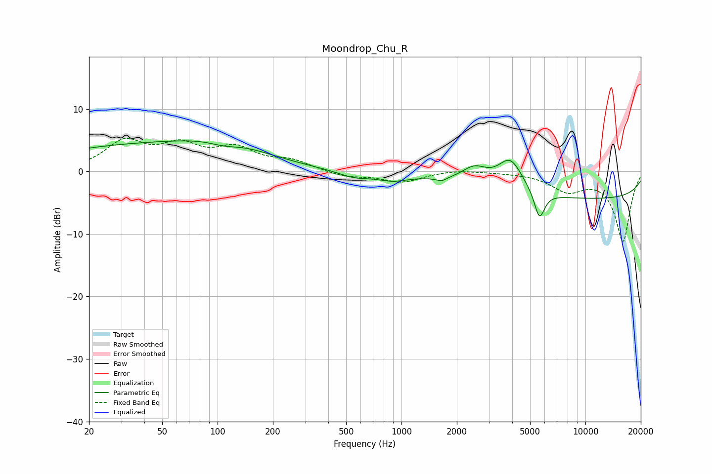

# Moondrop_Chu_R
See [usage instructions](https://github.com/jaakkopasanen/AutoEq#usage) for more options and info.

### Parametric EQs
Apply preamp of -5.0 dB when using parametric equalizer.

|   # | Type    |   Fc (Hz) |    Q |   Gain (dB) |
|-----|---------|-----------|------|-------------|
|   1 | Peaking |        34 | 0.29 |         3.9 |
|   2 | Peaking |       108 | 1.58 |        -1   |
|   3 | Peaking |       115 | 0.62 |         2.8 |
|   4 | Peaking |       555 | 1.55 |        -1   |
|   5 | Peaking |       895 | 1.78 |        -1   |
|   6 | Peaking |      1649 | 5.12 |        -0.6 |
|   7 | Peaking |      2493 | 2.01 |         2.6 |
|   8 | Peaking |      3906 | 2.08 |         5   |
|   9 | Peaking |      5624 | 4.93 |        -4.5 |
|  10 | Peaking |     10000 | 0.18 |        -4.4 |

### Fixed Band EQs
When using fixed band (also called graphic) equalizer, apply preamp of **-5.4 dB** (if available) and set gains manually with these parameters.

|   # | Type    |   Fc (Hz) |    Q |   Gain (dB) |
|-----|---------|-----------|------|-------------|
|   1 | Peaking |        31 | 1.41 |         4.5 |
|   2 | Peaking |        62 | 1.41 |         3.6 |
|   3 | Peaking |       125 | 1.41 |         3.3 |
|   4 | Peaking |       250 | 1.41 |         1.5 |
|   5 | Peaking |       500 | 1.41 |        -0.9 |
|   6 | Peaking |      1000 | 1.41 |        -1.7 |
|   7 | Peaking |      2000 | 1.41 |         0.3 |
|   8 | Peaking |      4000 | 1.41 |        -0.1 |
|   9 | Peaking |      8000 | 1.41 |        -2.8 |
|  10 | Peaking |     16000 | 1.41 |       -11.1 |

### Graphs

