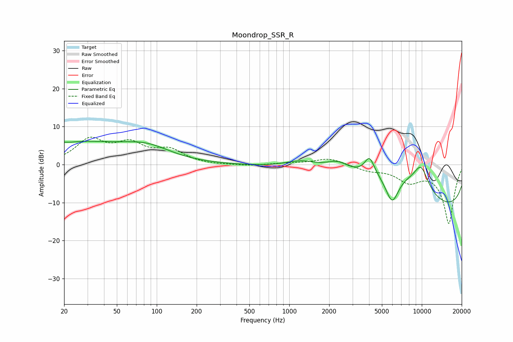

# Moondrop_SSR_R
See [usage instructions](https://github.com/jaakkopasanen/AutoEq#usage) for more options and info.

### Parametric EQs
Apply preamp of -6.2 dB when using parametric equalizer.

|   # | Type    |   Fc (Hz) |    Q |   Gain (dB) |
|-----|---------|-----------|------|-------------|
|   1 | Peaking |        20 | 0.28 |         6   |
|   2 | Peaking |        22 | 2.16 |        -0.4 |
|   3 | Peaking |        85 | 0.8  |         3   |
|   4 | Peaking |      1251 | 1.03 |         2.8 |
|   5 | Peaking |      2308 | 1.52 |         3.1 |
|   6 | Peaking |      4029 | 3.75 |         4.6 |
|   7 | Peaking |      5972 | 2.5  |        -8.5 |
|   8 | Peaking |      6485 | 0.45 |        12.5 |
|   9 | Peaking |      9870 | 2.15 |         6.3 |
|  10 | Peaking |     10000 | 0.18 |       -16.1 |

### Fixed Band EQs
When using fixed band (also called graphic) equalizer, apply preamp of **-7.3 dB** (if available) and set gains manually with these parameters.

|   # | Type    |   Fc (Hz) |    Q |   Gain (dB) |
|-----|---------|-----------|------|-------------|
|   1 | Peaking |        31 | 1.41 |         6.2 |
|   2 | Peaking |        62 | 1.41 |         4.8 |
|   3 | Peaking |       125 | 1.41 |         3.4 |
|   4 | Peaking |       250 | 1.41 |        -0.2 |
|   5 | Peaking |       500 | 1.41 |        -0.3 |
|   6 | Peaking |      1000 | 1.41 |         0.3 |
|   7 | Peaking |      2000 | 1.41 |         1.7 |
|   8 | Peaking |      4000 | 1.41 |        -1.4 |
|   9 | Peaking |      8000 | 1.41 |        -3.9 |
|  10 | Peaking |     16000 | 1.41 |       -15.4 |

### Graphs

