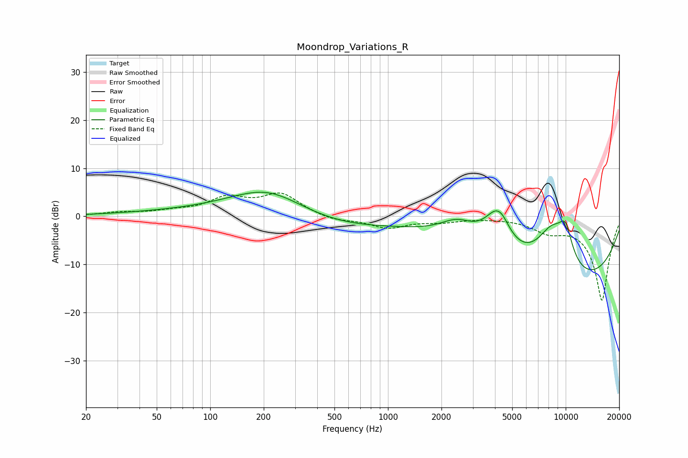

# Moondrop_Variations_R
See [usage instructions](https://github.com/jaakkopasanen/AutoEq#usage) for more options and info.

### Parametric EQs
Apply preamp of -5.1 dB when using parametric equalizer.

|   # | Type    |   Fc (Hz) |    Q |   Gain (dB) |
|-----|---------|-----------|------|-------------|
|   1 | Peaking |       177 | 0.18 |         1.1 |
|   2 | Peaking |       212 | 0.67 |         5.6 |
|   3 | Peaking |       498 | 0.46 |        -3.1 |
|   4 | Peaking |      2467 | 1.37 |         4.1 |
|   5 | Peaking |      4044 | 1.77 |         7.2 |
|   6 | Peaking |      4361 | 3.03 |         2.1 |
|   7 | Peaking |      8344 | 1.19 |        11.6 |
|   8 | Peaking |      9219 | 0.32 |       -10.4 |
|   9 | Peaking |      9974 | 3.09 |         6.3 |
|  10 | Peaking |     10000 | 0.22 |        -6.1 |

### Fixed Band EQs
When using fixed band (also called graphic) equalizer, apply preamp of **-5.0 dB** (if available) and set gains manually with these parameters.

|   # | Type    |   Fc (Hz) |    Q |   Gain (dB) |
|-----|---------|-----------|------|-------------|
|   1 | Peaking |        31 | 1.41 |         0.7 |
|   2 | Peaking |        62 | 1.41 |         0.8 |
|   3 | Peaking |       125 | 1.41 |         3.5 |
|   4 | Peaking |       250 | 1.41 |         4.4 |
|   5 | Peaking |       500 | 1.41 |        -1   |
|   6 | Peaking |      1000 | 1.41 |        -2.3 |
|   7 | Peaking |      2000 | 1.41 |        -0.9 |
|   8 | Peaking |      4000 | 1.41 |        -0.1 |
|   9 | Peaking |      8000 | 1.41 |        -2.5 |
|  10 | Peaking |     16000 | 1.41 |       -17.5 |

### Graphs

