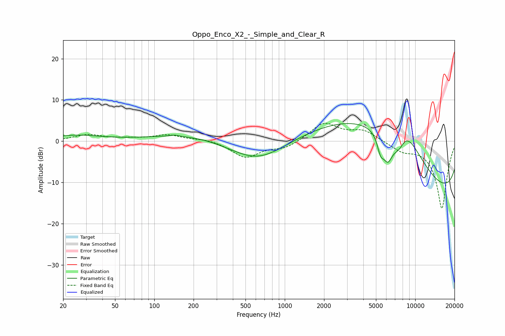

# Oppo_Enco_X2_-_Simple_and_Clear_R
See [usage instructions](https://github.com/jaakkopasanen/AutoEq#usage) for more options and info.

### Parametric EQs
Apply preamp of -4.4 dB when using parametric equalizer.

|   # | Type    |   Fc (Hz) |    Q |   Gain (dB) |
|-----|---------|-----------|------|-------------|
|   1 | Peaking |        25 | 0.75 |         1.4 |
|   2 | Peaking |       143 | 4.87 |         0.3 |
|   3 | Peaking |       617 | 0.53 |        -9   |
|   4 | Peaking |       638 | 0.21 |         5   |
|   5 | Peaking |      3573 | 0.33 |        11   |
|   6 | Peaking |      5422 | 5.36 |        -3.9 |
|   7 | Peaking |      6154 | 3.47 |        -6.2 |
|   8 | Peaking |      7530 | 1.94 |        -8.3 |
|   9 | Peaking |      8053 | 0.71 |        19.9 |
|  10 | Peaking |     10000 | 0.18 |       -20   |

### Fixed Band EQs
When using fixed band (also called graphic) equalizer, apply preamp of **-4.4 dB** (if available) and set gains manually with these parameters.

|   # | Type    |   Fc (Hz) |    Q |   Gain (dB) |
|-----|---------|-----------|------|-------------|
|   1 | Peaking |        31 | 1.41 |         1.5 |
|   2 | Peaking |        62 | 1.41 |         0.5 |
|   3 | Peaking |       125 | 1.41 |         1.5 |
|   4 | Peaking |       250 | 1.41 |         0.6 |
|   5 | Peaking |       500 | 1.41 |        -3.9 |
|   6 | Peaking |      1000 | 1.41 |        -1.7 |
|   7 | Peaking |      2000 | 1.41 |         4.4 |
|   8 | Peaking |      4000 | 1.41 |         2.5 |
|   9 | Peaking |      8000 | 1.41 |        -2   |
|  10 | Peaking |     16000 | 1.41 |       -16.3 |

### Graphs

