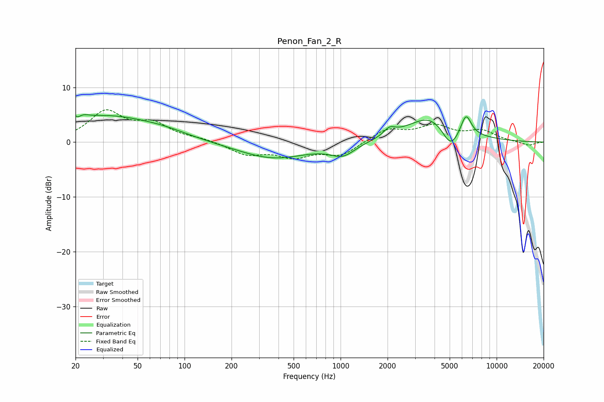

# Penon_Fan_2_R
See [usage instructions](https://github.com/jaakkopasanen/AutoEq#usage) for more options and info.

### Parametric EQs
Apply preamp of -5.1 dB when using parametric equalizer.

|   # | Type    |   Fc (Hz) |    Q |   Gain (dB) |
|-----|---------|-----------|------|-------------|
|   1 | Peaking |        20 | 3.38 |         4.4 |
|   2 | Peaking |        20 | 5.16 |        -3.2 |
|   3 | Peaking |        32 | 0.54 |         4.3 |
|   4 | Peaking |        73 | 0.83 |         1.1 |
|   5 | Peaking |       370 | 0.63 |        -3   |
|   6 | Peaking |      1035 | 1.8  |        -2.2 |
|   7 | Peaking |      2058 | 3.91 |         1.4 |
|   8 | Peaking |      3894 | 0.88 |         5.2 |
|   9 | Peaking |      5061 | 2.38 |        -4.6 |
|  10 | Peaking |      6363 | 4.09 |         3.9 |

### Fixed Band EQs
When using fixed band (also called graphic) equalizer, apply preamp of **-6.0 dB** (if available) and set gains manually with these parameters.

|   # | Type    |   Fc (Hz) |    Q |   Gain (dB) |
|-----|---------|-----------|------|-------------|
|   1 | Peaking |        31 | 1.41 |         5.3 |
|   2 | Peaking |        62 | 1.41 |         3   |
|   3 | Peaking |       125 | 1.41 |         0.5 |
|   4 | Peaking |       250 | 1.41 |        -2.1 |
|   5 | Peaking |       500 | 1.41 |        -2.4 |
|   6 | Peaking |      1000 | 1.41 |        -2.4 |
|   7 | Peaking |      2000 | 1.41 |         2.3 |
|   8 | Peaking |      4000 | 1.41 |         2.7 |
|   9 | Peaking |      8000 | 1.41 |         1.9 |
|  10 | Peaking |     16000 | 1.41 |        -0.7 |

### Graphs

