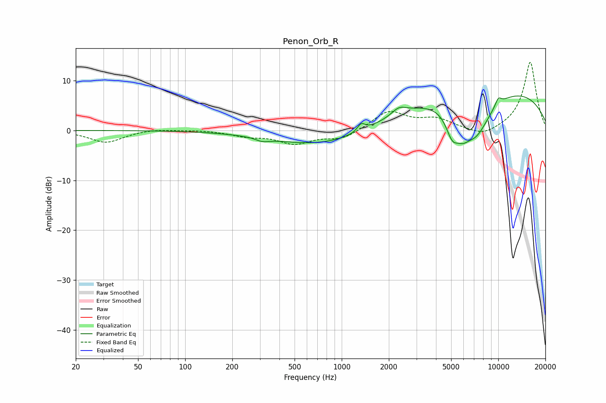

# Penon_Orb_R
See [usage instructions](https://github.com/jaakkopasanen/AutoEq#usage) for more options and info.

### Parametric EQs
Apply preamp of -7.0 dB when using parametric equalizer.

|   # | Type    |   Fc (Hz) |    Q |   Gain (dB) |
|-----|---------|-----------|------|-------------|
|   1 | Peaking |       302 | 2.15 |         0.3 |
|   2 | Peaking |       310 | 3.05 |        -0.9 |
|   3 | Peaking |       933 | 0.39 |        -4.1 |
|   4 | Peaking |      1332 | 6    |         1.5 |
|   5 | Peaking |      2320 | 3.16 |         1.4 |
|   6 | Peaking |      5086 | 3.3  |        -4.7 |
|   7 | Peaking |      5911 | 3.16 |        -2.6 |
|   8 | Peaking |      7137 | 1.27 |        -8.8 |
|   9 | Peaking |      7844 | 0.19 |         9.3 |
|  10 | Peaking |     10000 | 5.87 |         1.5 |

### Fixed Band EQs
When using fixed band (also called graphic) equalizer, apply preamp of **-13.7 dB** (if available) and set gains manually with these parameters.

|   # | Type    |   Fc (Hz) |    Q |   Gain (dB) |
|-----|---------|-----------|------|-------------|
|   1 | Peaking |        31 | 1.41 |        -2.4 |
|   2 | Peaking |        62 | 1.41 |         0.4 |
|   3 | Peaking |       125 | 1.41 |         0.1 |
|   4 | Peaking |       250 | 1.41 |        -1   |
|   5 | Peaking |       500 | 1.41 |        -2.5 |
|   6 | Peaking |      1000 | 1.41 |        -1.7 |
|   7 | Peaking |      2000 | 1.41 |         3.8 |
|   8 | Peaking |      4000 | 1.41 |         2.1 |
|   9 | Peaking |      8000 | 1.41 |        -1.5 |
|  10 | Peaking |     16000 | 1.41 |        13.8 |

### Graphs

