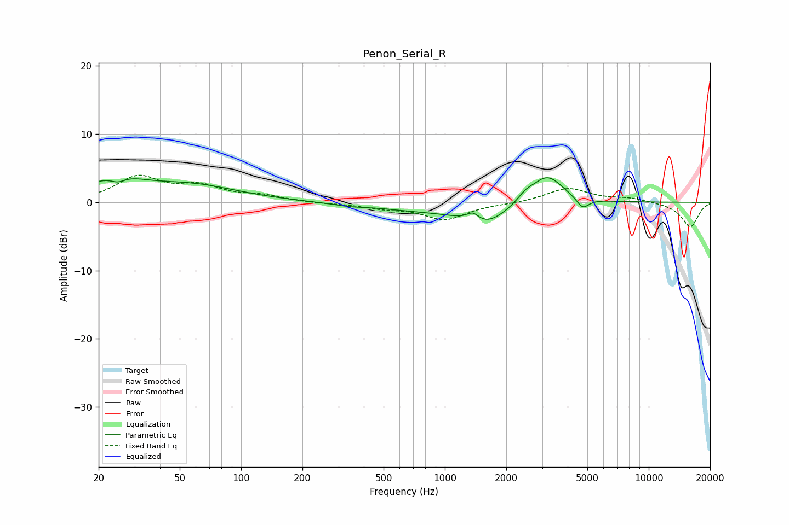

# Penon_Serial_R
See [usage instructions](https://github.com/jaakkopasanen/AutoEq#usage) for more options and info.

### Parametric EQs
Apply preamp of -3.7 dB when using parametric equalizer.

|   # | Type    |   Fc (Hz) |    Q |   Gain (dB) |
|-----|---------|-----------|------|-------------|
|   1 | Peaking |        24 | 1.12 |         3.1 |
|   2 | Peaking |        25 | 3.53 |        -1.1 |
|   3 | Peaking |        57 | 0.61 |         2.3 |
|   4 | Peaking |       339 | 1.92 |        -0.3 |
|   5 | Peaking |       804 | 0.59 |        -1.1 |
|   6 | Peaking |      1371 | 4.58 |         1.3 |
|   7 | Peaking |      1576 | 1.33 |        -2.9 |
|   8 | Peaking |      2480 | 3.73 |         0.9 |
|   9 | Peaking |      3169 | 1.79 |         4.2 |
|  10 | Peaking |      4741 | 4.64 |        -1.6 |

### Fixed Band EQs
When using fixed band (also called graphic) equalizer, apply preamp of **-4.1 dB** (if available) and set gains manually with these parameters.

|   # | Type    |   Fc (Hz) |    Q |   Gain (dB) |
|-----|---------|-----------|------|-------------|
|   1 | Peaking |        31 | 1.41 |         3.6 |
|   2 | Peaking |        62 | 1.41 |         2.1 |
|   3 | Peaking |       125 | 1.41 |         0.8 |
|   4 | Peaking |       250 | 1.41 |        -0.2 |
|   5 | Peaking |       500 | 1.41 |        -0.7 |
|   6 | Peaking |      1000 | 1.41 |        -2.5 |
|   7 | Peaking |      2000 | 1.41 |        -0.2 |
|   8 | Peaking |      4000 | 1.41 |         2.1 |
|   9 | Peaking |      8000 | 1.41 |         0.6 |
|  10 | Peaking |     16000 | 1.41 |        -3.6 |

### Graphs

