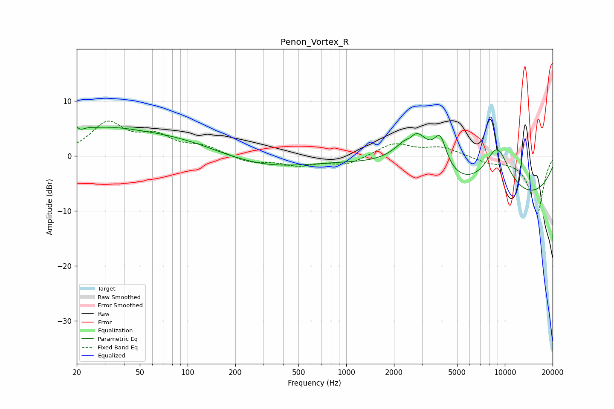

# Penon_Vortex_R
See [usage instructions](https://github.com/jaakkopasanen/AutoEq#usage) for more options and info.

### Parametric EQs
Apply preamp of -5.4 dB when using parametric equalizer.

|   # | Type    |   Fc (Hz) |    Q |   Gain (dB) |
|-----|---------|-----------|------|-------------|
|   1 | Peaking |        20 | 2.49 |         3.8 |
|   2 | Peaking |        21 | 4.15 |        -2.5 |
|   3 | Peaking |        36 | 1.59 |         0.5 |
|   4 | Peaking |        48 | 0.25 |         4.7 |
|   5 | Peaking |       275 | 0.44 |        -2.7 |
|   6 | Peaking |      2535 | 4.78 |        -1.3 |
|   7 | Peaking |      2685 | 1.51 |         8.5 |
|   8 | Peaking |      3915 | 3.46 |         5.5 |
|   9 | Peaking |      8947 | 1.45 |         9.3 |
|  10 | Peaking |      9734 | 0.23 |        -8.6 |

### Fixed Band EQs
When using fixed band (also called graphic) equalizer, apply preamp of **-6.4 dB** (if available) and set gains manually with these parameters.

|   # | Type    |   Fc (Hz) |    Q |   Gain (dB) |
|-----|---------|-----------|------|-------------|
|   1 | Peaking |        31 | 1.41 |         5.7 |
|   2 | Peaking |        62 | 1.41 |         3.1 |
|   3 | Peaking |       125 | 1.41 |         1.6 |
|   4 | Peaking |       250 | 1.41 |        -1.2 |
|   5 | Peaking |       500 | 1.41 |        -1.6 |
|   6 | Peaking |      1000 | 1.41 |        -1.6 |
|   7 | Peaking |      2000 | 1.41 |         2.3 |
|   8 | Peaking |      4000 | 1.41 |         1.5 |
|   9 | Peaking |      8000 | 1.41 |        -1   |
|  10 | Peaking |     16000 | 1.41 |       -10.5 |

### Graphs

