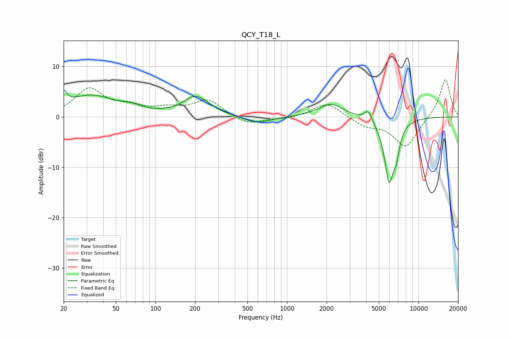

# QCY_T18_L
See [usage instructions](https://github.com/jaakkopasanen/AutoEq#usage) for more options and info.

### Parametric EQs
Apply preamp of -5.4 dB when using parametric equalizer.

|   # | Type    |   Fc (Hz) |    Q |   Gain (dB) |
|-----|---------|-----------|------|-------------|
|   1 | Peaking |        20 | 5.99 |         2.5 |
|   2 | Peaking |        32 | 0.74 |         4.1 |
|   3 | Peaking |        67 | 1.88 |         0.8 |
|   4 | Peaking |       194 | 2.21 |         0.6 |
|   5 | Peaking |       206 | 1.36 |         3.4 |
|   6 | Peaking |       594 | 1.37 |        -1.4 |
|   7 | Peaking |      2154 | 1.53 |         2.7 |
|   8 | Peaking |      4151 | 5.08 |         2.1 |
|   9 | Peaking |      5967 | 3.7  |       -12.1 |
|  10 | Peaking |      6772 | 5.41 |        -4.1 |

### Fixed Band EQs
When using fixed band (also called graphic) equalizer, apply preamp of **-7.5 dB** (if available) and set gains manually with these parameters.

|   # | Type    |   Fc (Hz) |    Q |   Gain (dB) |
|-----|---------|-----------|------|-------------|
|   1 | Peaking |        31 | 1.41 |         5.4 |
|   2 | Peaking |        62 | 1.41 |         1.7 |
|   3 | Peaking |       125 | 1.41 |         1.3 |
|   4 | Peaking |       250 | 1.41 |         3.3 |
|   5 | Peaking |       500 | 1.41 |        -1.6 |
|   6 | Peaking |      1000 | 1.41 |        -0.4 |
|   7 | Peaking |      2000 | 1.41 |         2.9 |
|   8 | Peaking |      4000 | 1.41 |        -1.7 |
|   9 | Peaking |      8000 | 1.41 |        -6   |
|  10 | Peaking |     16000 | 1.41 |         7.7 |

### Graphs

