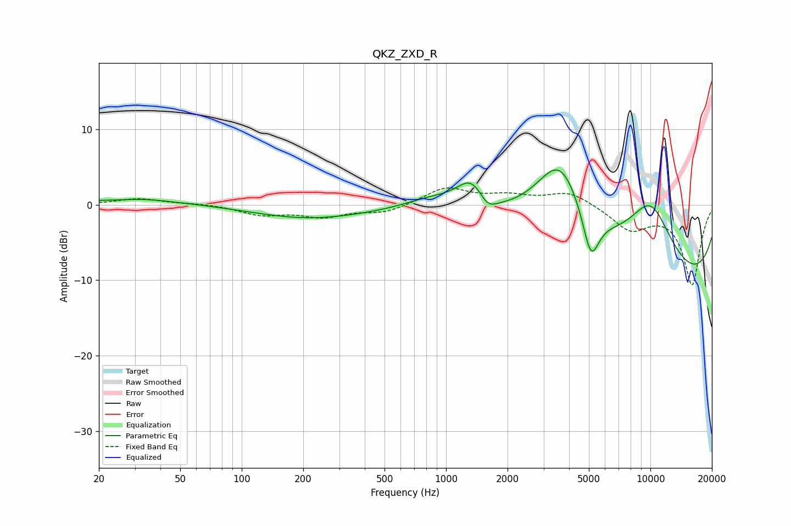

# QKZ_ZXD_R
See [usage instructions](https://github.com/jaakkopasanen/AutoEq#usage) for more options and info.

### Parametric EQs
Apply preamp of -4.7 dB when using parametric equalizer.

|   # | Type    |   Fc (Hz) |    Q |   Gain (dB) |
|-----|---------|-----------|------|-------------|
|   1 | Peaking |        28 | 0.38 |         0.6 |
|   2 | Peaking |        34 | 1.26 |         0.3 |
|   3 | Peaking |       211 | 0.51 |        -1.8 |
|   4 | Peaking |       858 | 1    |         1.8 |
|   5 | Peaking |      1334 | 1.9  |         4.1 |
|   6 | Peaking |      1594 | 3.28 |        -1.8 |
|   7 | Peaking |      3614 | 0.86 |        14.5 |
|   8 | Peaking |      5114 | 3.38 |        -6.5 |
|   9 | Peaking |      9253 | 0.2  |       -15.8 |
|  10 | Peaking |     10000 | 0.8  |        13.3 |

### Fixed Band EQs
When using fixed band (also called graphic) equalizer, apply preamp of **-2.3 dB** (if available) and set gains manually with these parameters.

|   # | Type    |   Fc (Hz) |    Q |   Gain (dB) |
|-----|---------|-----------|------|-------------|
|   1 | Peaking |        31 | 1.41 |         0.8 |
|   2 | Peaking |        62 | 1.41 |         0.2 |
|   3 | Peaking |       125 | 1.41 |        -1.2 |
|   4 | Peaking |       250 | 1.41 |        -1.4 |
|   5 | Peaking |       500 | 1.41 |        -1   |
|   6 | Peaking |      1000 | 1.41 |         2.2 |
|   7 | Peaking |      2000 | 1.41 |         1.1 |
|   8 | Peaking |      4000 | 1.41 |         1.8 |
|   9 | Peaking |      8000 | 1.41 |        -3.1 |
|  10 | Peaking |     16000 | 1.41 |       -10.5 |

### Graphs

