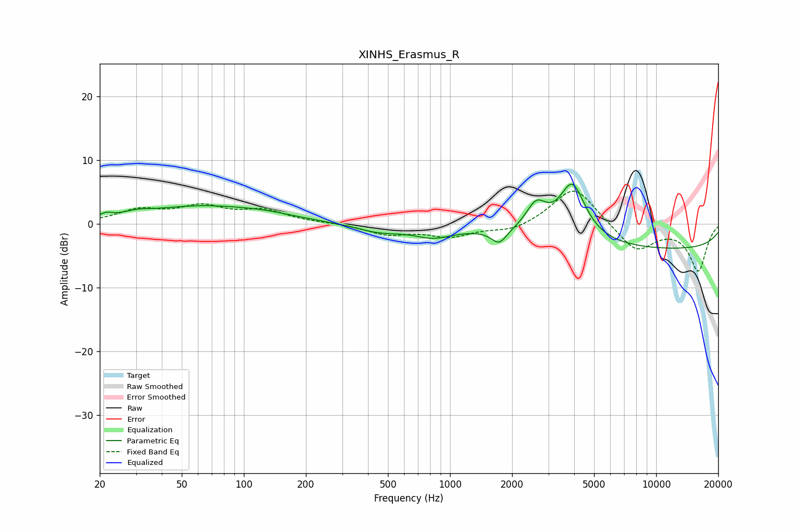

# XINHS_Erasmus_R
See [usage instructions](https://github.com/jaakkopasanen/AutoEq#usage) for more options and info.

### Parametric EQs
Apply preamp of -6.3 dB when using parametric equalizer.

|   # | Type    |   Fc (Hz) |    Q |   Gain (dB) |
|-----|---------|-----------|------|-------------|
|   1 | Peaking |        21 | 5.37 |         0.6 |
|   2 | Peaking |        30 | 2.4  |         0.5 |
|   3 | Peaking |        62 | 0.48 |         2.7 |
|   4 | Peaking |       131 | 1.07 |         0.5 |
|   5 | Peaking |       453 | 1.24 |        -1.2 |
|   6 | Peaking |       830 | 1.5  |        -1.6 |
|   7 | Peaking |      1731 | 3.85 |        -2.2 |
|   8 | Peaking |      2620 | 2.78 |         4.3 |
|   9 | Peaking |      3922 | 2.17 |         8.9 |
|  10 | Peaking |     10000 | 0.18 |        -4   |

### Fixed Band EQs
When using fixed band (also called graphic) equalizer, apply preamp of **-5.2 dB** (if available) and set gains manually with these parameters.

|   # | Type    |   Fc (Hz) |    Q |   Gain (dB) |
|-----|---------|-----------|------|-------------|
|   1 | Peaking |        31 | 1.41 |         2   |
|   2 | Peaking |        62 | 1.41 |         2.4 |
|   3 | Peaking |       125 | 1.41 |         1.9 |
|   4 | Peaking |       250 | 1.41 |         0.1 |
|   5 | Peaking |       500 | 1.41 |        -1.6 |
|   6 | Peaking |      1000 | 1.41 |        -1.9 |
|   7 | Peaking |      2000 | 1.41 |        -1.2 |
|   8 | Peaking |      4000 | 1.41 |         6.1 |
|   9 | Peaking |      8000 | 1.41 |        -4.4 |
|  10 | Peaking |     16000 | 1.41 |        -7.3 |

### Graphs

