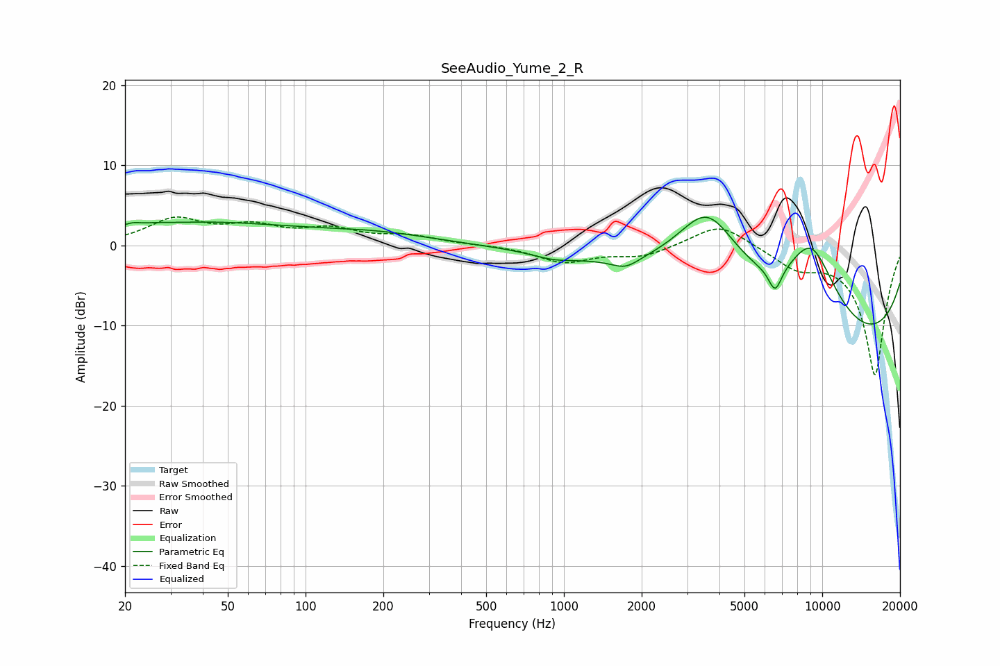

# SeeAudio_Yume_2_R
See [usage instructions](https://github.com/jaakkopasanen/AutoEq#usage) for more options and info.

### Parametric EQs
Apply preamp of -3.6 dB when using parametric equalizer.

|   # | Type    |   Fc (Hz) |    Q |   Gain (dB) |
|-----|---------|-----------|------|-------------|
|   1 | Peaking |        23 | 3.19 |         1.3 |
|   2 | Peaking |        23 | 4.41 |        -0.8 |
|   3 | Peaking |        39 | 0.39 |         2.7 |
|   4 | Peaking |       187 | 0.59 |         1.3 |
|   5 | Peaking |       911 | 1.76 |        -0.7 |
|   6 | Peaking |      1731 | 2.71 |        -1.2 |
|   7 | Peaking |      3593 | 0.95 |        12.1 |
|   8 | Peaking |      6573 | 5.33 |        -3.1 |
|   9 | Peaking |      9064 | 1.08 |        11.8 |
|  10 | Peaking |     10000 | 0.19 |       -14.3 |

### Fixed Band EQs
When using fixed band (also called graphic) equalizer, apply preamp of **-3.6 dB** (if available) and set gains manually with these parameters.

|   # | Type    |   Fc (Hz) |    Q |   Gain (dB) |
|-----|---------|-----------|------|-------------|
|   1 | Peaking |        31 | 1.41 |         3.1 |
|   2 | Peaking |        62 | 1.41 |         2   |
|   3 | Peaking |       125 | 1.41 |         1.8 |
|   4 | Peaking |       250 | 1.41 |         1   |
|   5 | Peaking |       500 | 1.41 |         0.1 |
|   6 | Peaking |      1000 | 1.41 |        -2   |
|   7 | Peaking |      2000 | 1.41 |        -1.3 |
|   8 | Peaking |      4000 | 1.41 |         2.9 |
|   9 | Peaking |      8000 | 1.41 |        -2.4 |
|  10 | Peaking |     16000 | 1.41 |       -16.2 |

### Graphs

