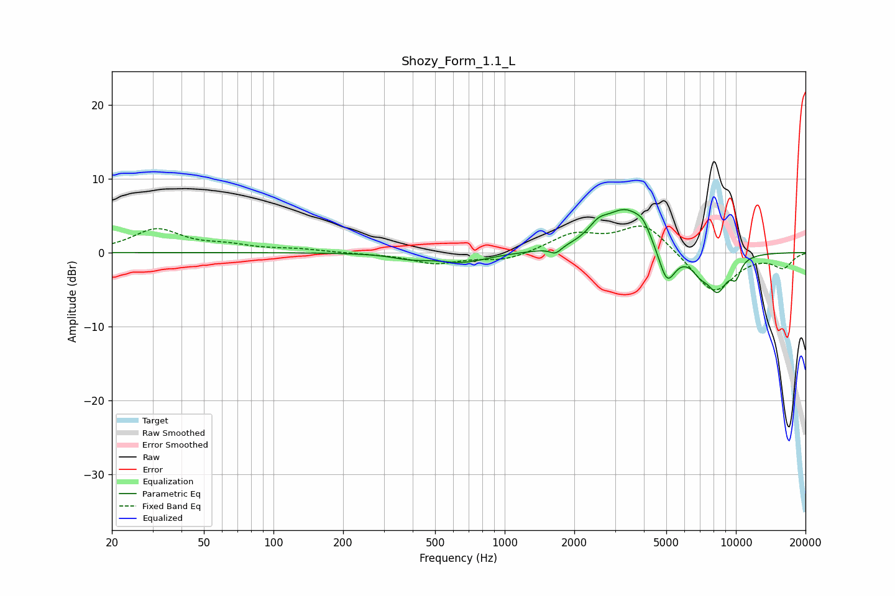

# Shozy_Form_1.1_L
See [usage instructions](https://github.com/jaakkopasanen/AutoEq#usage) for more options and info.

### Parametric EQs
Apply preamp of -5.9 dB when using parametric equalizer.

|   # | Type    |   Fc (Hz) |    Q |   Gain (dB) |
|-----|---------|-----------|------|-------------|
|   1 | Peaking |       391 | 1.81 |        -0.6 |
|   2 | Peaking |       658 | 1.29 |        -1.3 |
|   3 | Peaking |      1661 | 6    |        -0.9 |
|   4 | Peaking |      2540 | 3.27 |         1.7 |
|   5 | Peaking |      3341 | 1.52 |         5.7 |
|   6 | Peaking |      3968 | 4.46 |         1.3 |
|   7 | Peaking |      5030 | 3.68 |        -5.1 |
|   8 | Peaking |      6996 | 3.62 |        -1.7 |
|   9 | Peaking |      8326 | 2.79 |        -4.9 |
|  10 | Peaking |     10000 | 5.81 |        -2.1 |

### Fixed Band EQs
When using fixed band (also called graphic) equalizer, apply preamp of **-3.7 dB** (if available) and set gains manually with these parameters.

|   # | Type    |   Fc (Hz) |    Q |   Gain (dB) |
|-----|---------|-----------|------|-------------|
|   1 | Peaking |        31 | 1.41 |         3.1 |
|   2 | Peaking |        62 | 1.41 |         0.8 |
|   3 | Peaking |       125 | 1.41 |         0.4 |
|   4 | Peaking |       250 | 1.41 |        -0.1 |
|   5 | Peaking |       500 | 1.41 |        -1.4 |
|   6 | Peaking |      1000 | 1.41 |        -1.1 |
|   7 | Peaking |      2000 | 1.41 |         2.4 |
|   8 | Peaking |      4000 | 1.41 |         4   |
|   9 | Peaking |      8000 | 1.41 |        -5.6 |
|  10 | Peaking |     16000 | 1.41 |        -1.9 |

### Graphs

