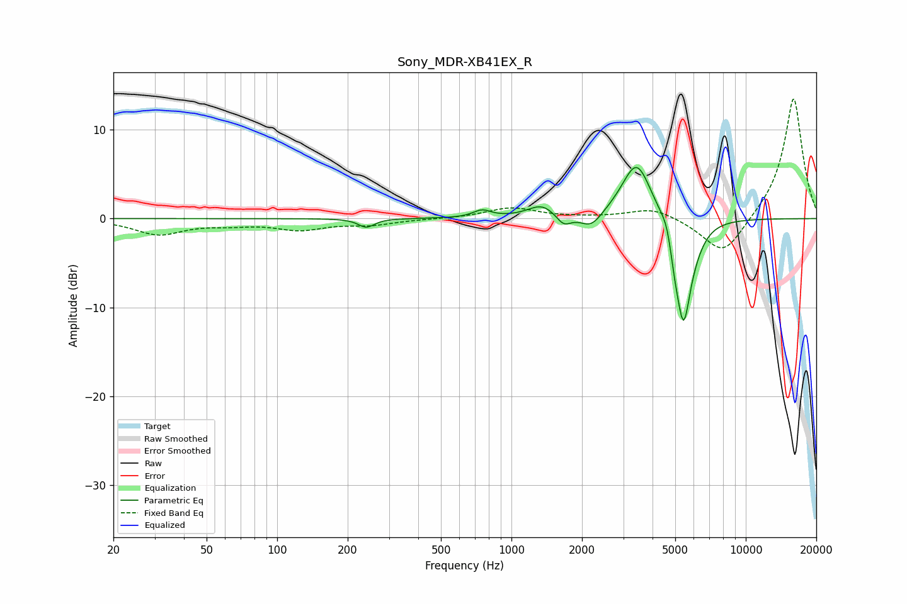

# Sony_MDR-XB41EX_R
See [usage instructions](https://github.com/jaakkopasanen/AutoEq#usage) for more options and info.

### Parametric EQs
Apply preamp of -5.8 dB when using parametric equalizer.

|   # | Type    |   Fc (Hz) |    Q |   Gain (dB) |
|-----|---------|-----------|------|-------------|
|   1 | Peaking |       240 | 4.27 |        -1   |
|   2 | Peaking |       749 | 3.7  |         0.8 |
|   3 | Peaking |      1346 | 2.39 |         1.4 |
|   4 | Peaking |      1671 | 4.51 |        -1.3 |
|   5 | Peaking |      2191 | 3.02 |        -1.7 |
|   6 | Peaking |      3424 | 2.2  |         6.6 |
|   7 | Peaking |      4621 | 5.99 |         1.5 |
|   8 | Peaking |      4973 | 6    |        -2.3 |
|   9 | Peaking |      5425 | 4.3  |       -11   |
|  10 | Peaking |      6004 | 2.92 |        -1.3 |

### Fixed Band EQs
When using fixed band (also called graphic) equalizer, apply preamp of **-13.6 dB** (if available) and set gains manually with these parameters.

|   # | Type    |   Fc (Hz) |    Q |   Gain (dB) |
|-----|---------|-----------|------|-------------|
|   1 | Peaking |        31 | 1.41 |        -1.7 |
|   2 | Peaking |        62 | 1.41 |        -0.5 |
|   3 | Peaking |       125 | 1.41 |        -1.1 |
|   4 | Peaking |       250 | 1.41 |        -0.6 |
|   5 | Peaking |       500 | 1.41 |        -0   |
|   6 | Peaking |      1000 | 1.41 |         1.2 |
|   7 | Peaking |      2000 | 1.41 |         0.1 |
|   8 | Peaking |      4000 | 1.41 |         1.2 |
|   9 | Peaking |      8000 | 1.41 |        -4.4 |
|  10 | Peaking |     16000 | 1.41 |        13.8 |

### Graphs

