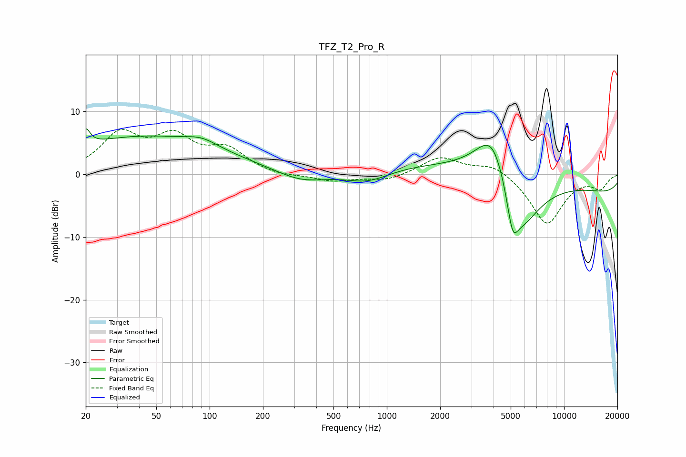

# TFZ_T2_Pro_R
See [usage instructions](https://github.com/jaakkopasanen/AutoEq#usage) for more options and info.

### Parametric EQs
Apply preamp of -7.3 dB when using parametric equalizer.

|   # | Type    |   Fc (Hz) |    Q |   Gain (dB) |
|-----|---------|-----------|------|-------------|
|   1 | Peaking |        20 | 5.93 |         2.6 |
|   2 | Peaking |        43 | 0.31 |         5.9 |
|   3 | Peaking |        90 | 1.62 |         1.2 |
|   4 | Peaking |       330 | 1    |        -1.7 |
|   5 | Peaking |       783 | 1.15 |        -1.9 |
|   6 | Peaking |      3964 | 1.38 |         9.6 |
|   7 | Peaking |      4936 | 0.21 |         4   |
|   8 | Peaking |      5122 | 4.39 |        -5.6 |
|   9 | Peaking |      5685 | 1.22 |        -9.8 |
|  10 | Peaking |     10000 | 0.18 |        -4.8 |

### Fixed Band EQs
When using fixed band (also called graphic) equalizer, apply preamp of **-7.3 dB** (if available) and set gains manually with these parameters.

|   # | Type    |   Fc (Hz) |    Q |   Gain (dB) |
|-----|---------|-----------|------|-------------|
|   1 | Peaking |        31 | 1.41 |         6   |
|   2 | Peaking |        62 | 1.41 |         5.2 |
|   3 | Peaking |       125 | 1.41 |         3.6 |
|   4 | Peaking |       250 | 1.41 |        -0.4 |
|   5 | Peaking |       500 | 1.41 |        -1.1 |
|   6 | Peaking |      1000 | 1.41 |        -1   |
|   7 | Peaking |      2000 | 1.41 |         2.8 |
|   8 | Peaking |      4000 | 1.41 |         1.8 |
|   9 | Peaking |      8000 | 1.41 |        -8   |
|  10 | Peaking |     16000 | 1.41 |        -2.1 |

### Graphs

