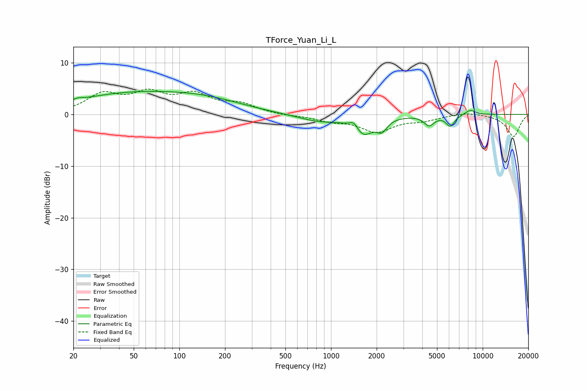

# TForce_Yuan_Li_L
See [usage instructions](https://github.com/jaakkopasanen/AutoEq#usage) for more options and info.

### Parametric EQs
Apply preamp of -4.5 dB when using parametric equalizer.

|   # | Type    |   Fc (Hz) |    Q |   Gain (dB) |
|-----|---------|-----------|------|-------------|
|   1 | Peaking |        22 | 5.96 |         0.3 |
|   2 | Peaking |        52 | 0.33 |         4   |
|   3 | Peaking |       164 | 0.61 |         1.4 |
|   4 | Peaking |       830 | 0.99 |        -1.3 |
|   5 | Peaking |      1416 | 4.92 |         1.5 |
|   6 | Peaking |      1625 | 2.18 |        -3.6 |
|   7 | Peaking |      2167 | 4.14 |        -2.1 |
|   8 | Peaking |      4437 | 4.23 |        -1.9 |
|   9 | Peaking |      6119 | 4.89 |        -2.1 |
|  10 | Peaking |      8289 | 3.87 |         1   |

### Fixed Band EQs
When using fixed band (also called graphic) equalizer, apply preamp of **-5.0 dB** (if available) and set gains manually with these parameters.

|   # | Type    |   Fc (Hz) |    Q |   Gain (dB) |
|-----|---------|-----------|------|-------------|
|   1 | Peaking |        31 | 1.41 |         3.6 |
|   2 | Peaking |        62 | 1.41 |         3.5 |
|   3 | Peaking |       125 | 1.41 |         3.4 |
|   4 | Peaking |       250 | 1.41 |         1.8 |
|   5 | Peaking |       500 | 1.41 |        -0.2 |
|   6 | Peaking |      1000 | 1.41 |        -1.1 |
|   7 | Peaking |      2000 | 1.41 |        -3.2 |
|   8 | Peaking |      4000 | 1.41 |        -1   |
|   9 | Peaking |      8000 | 1.41 |         0.5 |
|  10 | Peaking |     16000 | 1.41 |        -4.3 |

### Graphs

