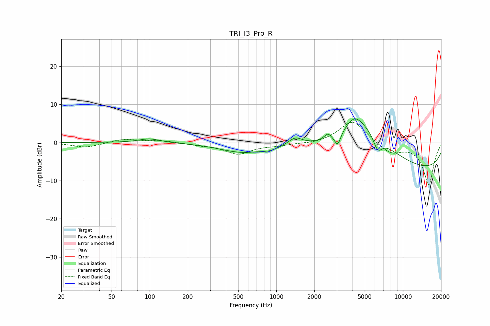

# TRI_I3_Pro_R
See [usage instructions](https://github.com/jaakkopasanen/AutoEq#usage) for more options and info.

### Parametric EQs
Apply preamp of -6.3 dB when using parametric equalizer.

|   # | Type    |   Fc (Hz) |    Q |   Gain (dB) |
|-----|---------|-----------|------|-------------|
|   1 | Peaking |       100 | 1.69 |         1.1 |
|   2 | Peaking |       541 | 0.78 |        -2.5 |
|   3 | Peaking |       892 | 2.5  |        -0.7 |
|   4 | Peaking |      1412 | 2.65 |         2.1 |
|   5 | Peaking |      2548 | 5.69 |         1.4 |
|   6 | Peaking |      3053 | 5.87 |        -3.3 |
|   7 | Peaking |      4125 | 2.15 |         3.4 |
|   8 | Peaking |      4852 | 0.62 |        10.3 |
|   9 | Peaking |      6325 | 3.82 |        -3.8 |
|  10 | Peaking |      9967 | 0.18 |        -8   |

### Fixed Band EQs
When using fixed band (also called graphic) equalizer, apply preamp of **-5.4 dB** (if available) and set gains manually with these parameters.

|   # | Type    |   Fc (Hz) |    Q |   Gain (dB) |
|-----|---------|-----------|------|-------------|
|   1 | Peaking |        31 | 1.41 |        -1.3 |
|   2 | Peaking |        62 | 1.41 |         0.9 |
|   3 | Peaking |       125 | 1.41 |         0.5 |
|   4 | Peaking |       250 | 1.41 |        -0.5 |
|   5 | Peaking |       500 | 1.41 |        -2.9 |
|   6 | Peaking |      1000 | 1.41 |        -0.6 |
|   7 | Peaking |      2000 | 1.41 |        -0.4 |
|   8 | Peaking |      4000 | 1.41 |         5.9 |
|   9 | Peaking |      8000 | 1.41 |        -2.8 |
|  10 | Peaking |     16000 | 1.41 |       -11.1 |

### Graphs

