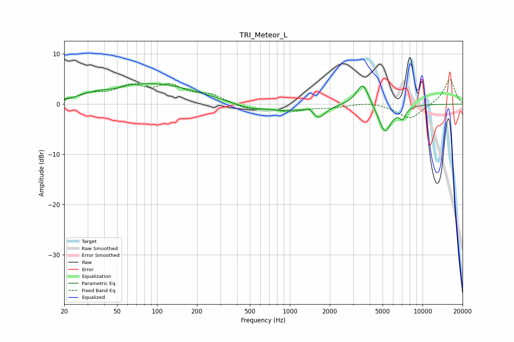

# TRI_Meteor_L
See [usage instructions](https://github.com/jaakkopasanen/AutoEq#usage) for more options and info.

### Parametric EQs
Apply preamp of -4.1 dB when using parametric equalizer.

|   # | Type    |   Fc (Hz) |    Q |   Gain (dB) |
|-----|---------|-----------|------|-------------|
|   1 | Peaking |        33 | 1.37 |         0.9 |
|   2 | Peaking |        65 | 2.4  |         0.3 |
|   3 | Peaking |        98 | 0.46 |         3.9 |
|   4 | Peaking |       483 | 1.26 |        -0.9 |
|   5 | Peaking |       894 | 1.01 |        -1.1 |
|   6 | Peaking |      1407 | 6    |         0.6 |
|   7 | Peaking |      1659 | 2.9  |        -2.4 |
|   8 | Peaking |      3538 | 2.92 |         4.6 |
|   9 | Peaking |      5199 | 2.82 |        -5.8 |
|  10 | Peaking |      7062 | 5.51 |        -2.1 |

### Fixed Band EQs
When using fixed band (also called graphic) equalizer, apply preamp of **-5.0 dB** (if available) and set gains manually with these parameters.

|   # | Type    |   Fc (Hz) |    Q |   Gain (dB) |
|-----|---------|-----------|------|-------------|
|   1 | Peaking |        31 | 1.41 |         1.7 |
|   2 | Peaking |        62 | 1.41 |         3.1 |
|   3 | Peaking |       125 | 1.41 |         3.2 |
|   4 | Peaking |       250 | 1.41 |         1.7 |
|   5 | Peaking |       500 | 1.41 |        -1.1 |
|   6 | Peaking |      1000 | 1.41 |        -1.3 |
|   7 | Peaking |      2000 | 1.41 |        -0.6 |
|   8 | Peaking |      4000 | 1.41 |         0.5 |
|   9 | Peaking |      8000 | 1.41 |        -3   |
|  10 | Peaking |     16000 | 1.41 |         5   |

### Graphs

