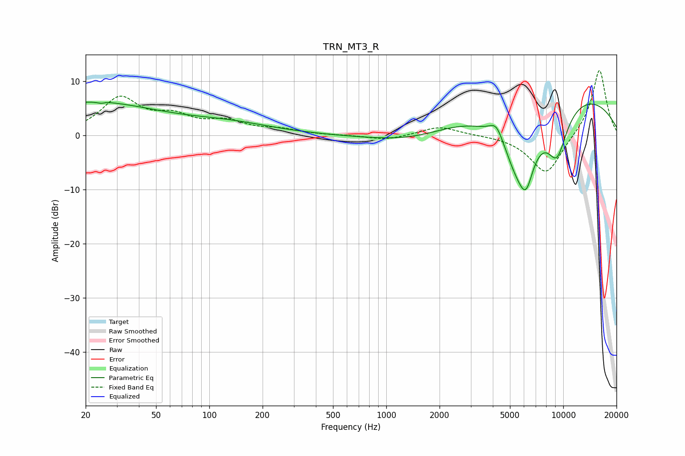

# TRN_MT3_R
See [usage instructions](https://github.com/jaakkopasanen/AutoEq#usage) for more options and info.

### Parametric EQs
Apply preamp of -6.2 dB when using parametric equalizer.

|   # | Type    |   Fc (Hz) |    Q |   Gain (dB) |
|-----|---------|-----------|------|-------------|
|   1 | Peaking |        21 | 0.36 |         6   |
|   2 | Peaking |        25 | 5.52 |        -3.1 |
|   3 | Peaking |        25 | 5.29 |         2.9 |
|   4 | Peaking |       130 | 0.56 |         1.8 |
|   5 | Peaking |      1499 | 0.57 |        -2.9 |
|   6 | Peaking |      4198 | 3.46 |         3.2 |
|   7 | Peaking |      5542 | 1.21 |       -12.8 |
|   8 | Peaking |      6173 | 3.42 |        -5.8 |
|   9 | Peaking |      7886 | 0.22 |         9.4 |
|  10 | Peaking |      9219 | 2.07 |        -8.8 |

### Fixed Band EQs
When using fixed band (also called graphic) equalizer, apply preamp of **-12.1 dB** (if available) and set gains manually with these parameters.

|   # | Type    |   Fc (Hz) |    Q |   Gain (dB) |
|-----|---------|-----------|------|-------------|
|   1 | Peaking |        31 | 1.41 |         6.6 |
|   2 | Peaking |        62 | 1.41 |         2.9 |
|   3 | Peaking |       125 | 1.41 |         2.2 |
|   4 | Peaking |       250 | 1.41 |         0.9 |
|   5 | Peaking |       500 | 1.41 |        -0   |
|   6 | Peaking |      1000 | 1.41 |        -0.9 |
|   7 | Peaking |      2000 | 1.41 |         1.7 |
|   8 | Peaking |      4000 | 1.41 |         0.1 |
|   9 | Peaking |      8000 | 1.41 |        -7.4 |
|  10 | Peaking |     16000 | 1.41 |        12.4 |

### Graphs

