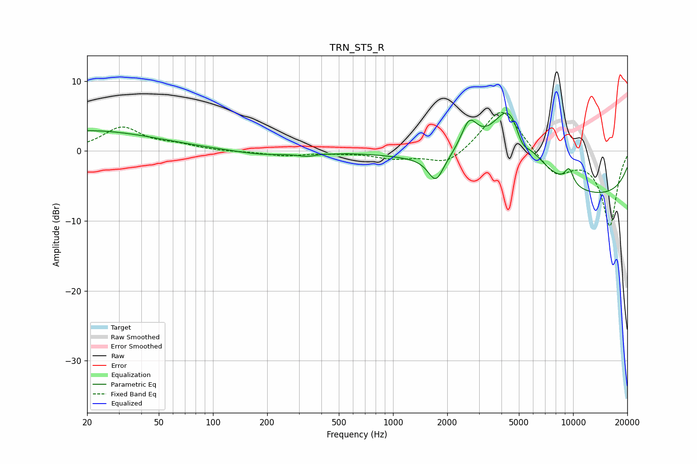

# TRN_ST5_R
See [usage instructions](https://github.com/jaakkopasanen/AutoEq#usage) for more options and info.

### Parametric EQs
Apply preamp of -5.5 dB when using parametric equalizer.

|   # | Type    |   Fc (Hz) |    Q |   Gain (dB) |
|-----|---------|-----------|------|-------------|
|   1 | Peaking |        20 | 0.36 |         2.9 |
|   2 | Peaking |       189 | 0.9  |        -0.6 |
|   3 | Peaking |       334 | 2.84 |        -0.4 |
|   4 | Peaking |       470 | 5.62 |        -0   |
|   5 | Peaking |      1728 | 3.37 |        -3.5 |
|   6 | Peaking |      2648 | 2.99 |         4.5 |
|   7 | Peaking |      4496 | 1.17 |        12   |
|   8 | Peaking |      5187 | 3.41 |        -3.1 |
|   9 | Peaking |      9495 | 5.11 |         2.3 |
|  10 | Peaking |     10000 | 0.18 |        -6.9 |

### Fixed Band EQs
When using fixed band (also called graphic) equalizer, apply preamp of **-5.6 dB** (if available) and set gains manually with these parameters.

|   # | Type    |   Fc (Hz) |    Q |   Gain (dB) |
|-----|---------|-----------|------|-------------|
|   1 | Peaking |        31 | 1.41 |         3.3 |
|   2 | Peaking |        62 | 1.41 |         0.7 |
|   3 | Peaking |       125 | 1.41 |        -0.1 |
|   4 | Peaking |       250 | 1.41 |        -0.7 |
|   5 | Peaking |       500 | 1.41 |        -0.2 |
|   6 | Peaking |      1000 | 1.41 |        -1   |
|   7 | Peaking |      2000 | 1.41 |        -2.1 |
|   8 | Peaking |      4000 | 1.41 |         6.5 |
|   9 | Peaking |      8000 | 1.41 |        -3.5 |
|  10 | Peaking |     16000 | 1.41 |       -10.6 |

### Graphs

