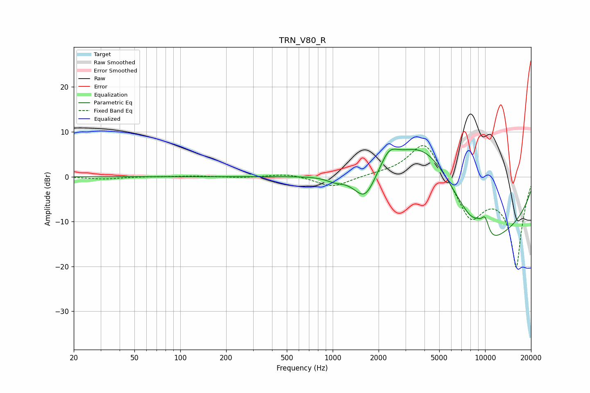

# TRN_V80_R
See [usage instructions](https://github.com/jaakkopasanen/AutoEq#usage) for more options and info.

### Parametric EQs
Apply preamp of -6.2 dB when using parametric equalizer.

|   # | Type    |   Fc (Hz) |    Q |   Gain (dB) |
|-----|---------|-----------|------|-------------|
|   1 | Peaking |      1035 | 2.43 |        -1   |
|   2 | Peaking |      1629 | 1.89 |        -6.8 |
|   3 | Peaking |      2338 | 2.58 |         3.6 |
|   4 | Peaking |      3809 | 0.49 |         6.4 |
|   5 | Peaking |      4083 | 0.68 |         8.8 |
|   6 | Peaking |      8982 | 2.85 |         3.2 |
|   7 | Peaking |      9539 | 1.2  |        -7.3 |
|   8 | Peaking |      9920 | 0.25 |       -13.3 |
|   9 | Peaking |     10000 | 5.81 |         0.4 |
|  10 | Peaking |     10000 | 4.08 |         4.5 |

### Fixed Band EQs
When using fixed band (also called graphic) equalizer, apply preamp of **-7.0 dB** (if available) and set gains manually with these parameters.

|   # | Type    |   Fc (Hz) |    Q |   Gain (dB) |
|-----|---------|-----------|------|-------------|
|   1 | Peaking |        31 | 1.41 |        -0.5 |
|   2 | Peaking |        62 | 1.41 |         0   |
|   3 | Peaking |       125 | 1.41 |         0.2 |
|   4 | Peaking |       250 | 1.41 |        -0.2 |
|   5 | Peaking |       500 | 1.41 |         0.7 |
|   6 | Peaking |      1000 | 1.41 |        -2.4 |
|   7 | Peaking |      2000 | 1.41 |         0.4 |
|   8 | Peaking |      4000 | 1.41 |         8.7 |
|   9 | Peaking |      8000 | 1.41 |        -9   |
|  10 | Peaking |     16000 | 1.41 |       -20   |

### Graphs

