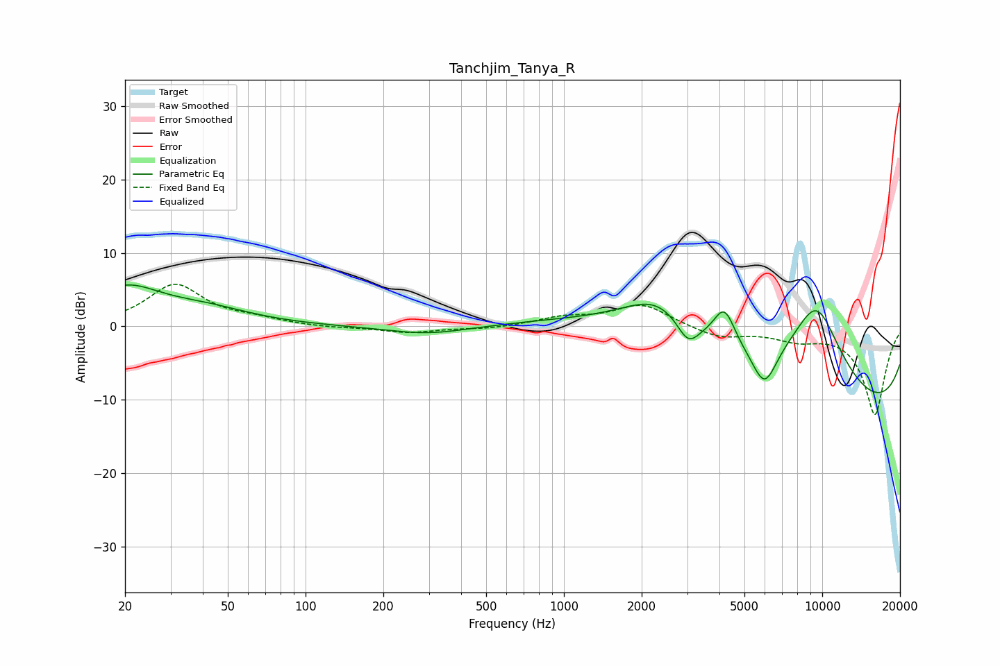

# Tanchjim_Tanya_R
See [usage instructions](https://github.com/jaakkopasanen/AutoEq#usage) for more options and info.

### Parametric EQs
Apply preamp of -5.7 dB when using parametric equalizer.

|   # | Type    |   Fc (Hz) |    Q |   Gain (dB) |
|-----|---------|-----------|------|-------------|
|   1 | Peaking |        20 | 1.03 |         4.8 |
|   2 | Peaking |        41 | 0.79 |         1.9 |
|   3 | Peaking |       298 | 0.88 |        -1.2 |
|   4 | Peaking |      2341 | 0.98 |         5.4 |
|   5 | Peaking |      3023 | 3.2  |        -3.4 |
|   6 | Peaking |      3572 | 0.25 |         5.5 |
|   7 | Peaking |      4184 | 3.29 |         5.1 |
|   8 | Peaking |      5980 | 2.85 |        -5.4 |
|   9 | Peaking |      9500 | 1.04 |        13.5 |
|  10 | Peaking |     10000 | 0.18 |       -15   |

### Fixed Band EQs
When using fixed band (also called graphic) equalizer, apply preamp of **-5.8 dB** (if available) and set gains manually with these parameters.

|   # | Type    |   Fc (Hz) |    Q |   Gain (dB) |
|-----|---------|-----------|------|-------------|
|   1 | Peaking |        31 | 1.41 |         5.6 |
|   2 | Peaking |        62 | 1.41 |         0.7 |
|   3 | Peaking |       125 | 1.41 |        -0.2 |
|   4 | Peaking |       250 | 1.41 |        -0.8 |
|   5 | Peaking |       500 | 1.41 |        -0.4 |
|   6 | Peaking |      1000 | 1.41 |         1.1 |
|   7 | Peaking |      2000 | 1.41 |         3   |
|   8 | Peaking |      4000 | 1.41 |        -1.5 |
|   9 | Peaking |      8000 | 1.41 |        -1.5 |
|  10 | Peaking |     16000 | 1.41 |       -12   |

### Graphs

