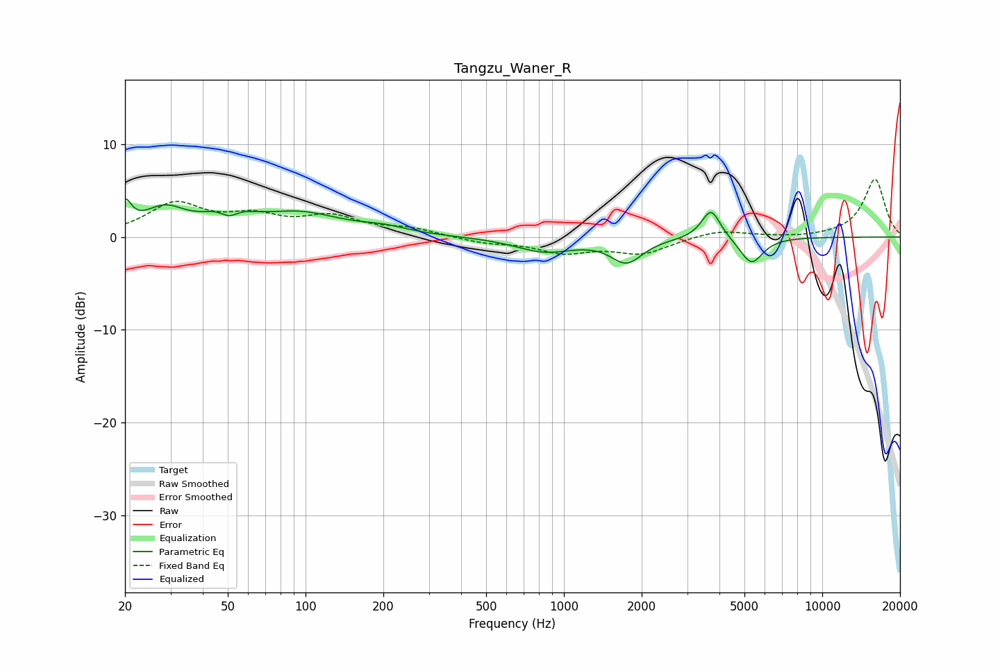

# Tangzu_Waner_R
See [usage instructions](https://github.com/jaakkopasanen/AutoEq#usage) for more options and info.

### Parametric EQs
Apply preamp of -4.2 dB when using parametric equalizer.

|   # | Type    |   Fc (Hz) |    Q |   Gain (dB) |
|-----|---------|-----------|------|-------------|
|   1 | Peaking |        20 | 5.87 |         2.8 |
|   2 | Peaking |        28 | 1.74 |         2.7 |
|   3 | Peaking |        50 | 1.86 |         2.5 |
|   4 | Peaking |        51 | 3.68 |        -1.7 |
|   5 | Peaking |        95 | 0.88 |         2.3 |
|   6 | Peaking |       201 | 1.48 |         0.6 |
|   7 | Peaking |       843 | 1.26 |        -1.5 |
|   8 | Peaking |      1749 | 2.35 |        -2.6 |
|   9 | Peaking |      3710 | 3.87 |         3.2 |
|  10 | Peaking |      5319 | 3.17 |        -2.9 |

### Fixed Band EQs
When using fixed band (also called graphic) equalizer, apply preamp of **-6.3 dB** (if available) and set gains manually with these parameters.

|   # | Type    |   Fc (Hz) |    Q |   Gain (dB) |
|-----|---------|-----------|------|-------------|
|   1 | Peaking |        31 | 1.41 |         3.4 |
|   2 | Peaking |        62 | 1.41 |         1.9 |
|   3 | Peaking |       125 | 1.41 |         1.9 |
|   4 | Peaking |       250 | 1.41 |         0.8 |
|   5 | Peaking |       500 | 1.41 |        -0.6 |
|   6 | Peaking |      1000 | 1.41 |        -1.5 |
|   7 | Peaking |      2000 | 1.41 |        -1.7 |
|   8 | Peaking |      4000 | 1.41 |         0.8 |
|   9 | Peaking |      8000 | 1.41 |        -0.1 |
|  10 | Peaking |     16000 | 1.41 |         6.2 |

### Graphs

