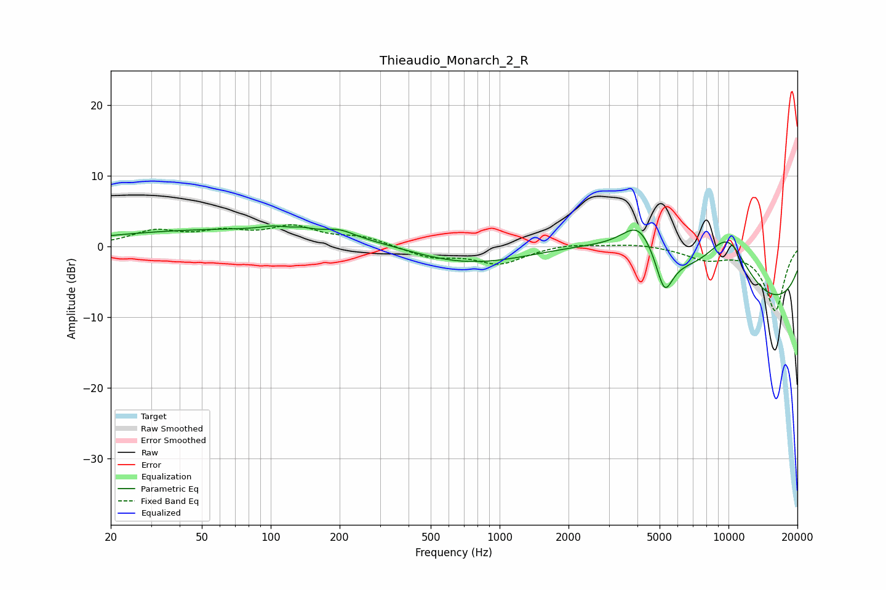

# Thieaudio_Monarch_2_R
See [usage instructions](https://github.com/jaakkopasanen/AutoEq#usage) for more options and info.

### Parametric EQs
Apply preamp of -3.0 dB when using parametric equalizer.

|   # | Type    |   Fc (Hz) |    Q |   Gain (dB) |
|-----|---------|-----------|------|-------------|
|   1 | Peaking |        92 | 0.18 |         2.5 |
|   2 | Peaking |       103 | 2.72 |         0.5 |
|   3 | Peaking |       137 | 3.33 |         0.4 |
|   4 | Peaking |       201 | 2.35 |         0.9 |
|   5 | Peaking |       694 | 0.5  |        -3.2 |
|   6 | Peaking |      3084 | 0.46 |         5.7 |
|   7 | Peaking |      4061 | 1.83 |         5   |
|   8 | Peaking |      5251 | 3.8  |        -5.5 |
|   9 | Peaking |      9885 | 1.1  |         9   |
|  10 | Peaking |     10000 | 0.18 |       -10.1 |

### Fixed Band EQs
When using fixed band (also called graphic) equalizer, apply preamp of **-3.1 dB** (if available) and set gains manually with these parameters.

|   # | Type    |   Fc (Hz) |    Q |   Gain (dB) |
|-----|---------|-----------|------|-------------|
|   1 | Peaking |        31 | 1.41 |         2   |
|   2 | Peaking |        62 | 1.41 |         1.7 |
|   3 | Peaking |       125 | 1.41 |         2.5 |
|   4 | Peaking |       250 | 1.41 |         1.2 |
|   5 | Peaking |       500 | 1.41 |        -1.5 |
|   6 | Peaking |      1000 | 1.41 |        -2.4 |
|   7 | Peaking |      2000 | 1.41 |         0.5 |
|   8 | Peaking |      4000 | 1.41 |         0.4 |
|   9 | Peaking |      8000 | 1.41 |        -1.6 |
|  10 | Peaking |     16000 | 1.41 |        -9.1 |

### Graphs

