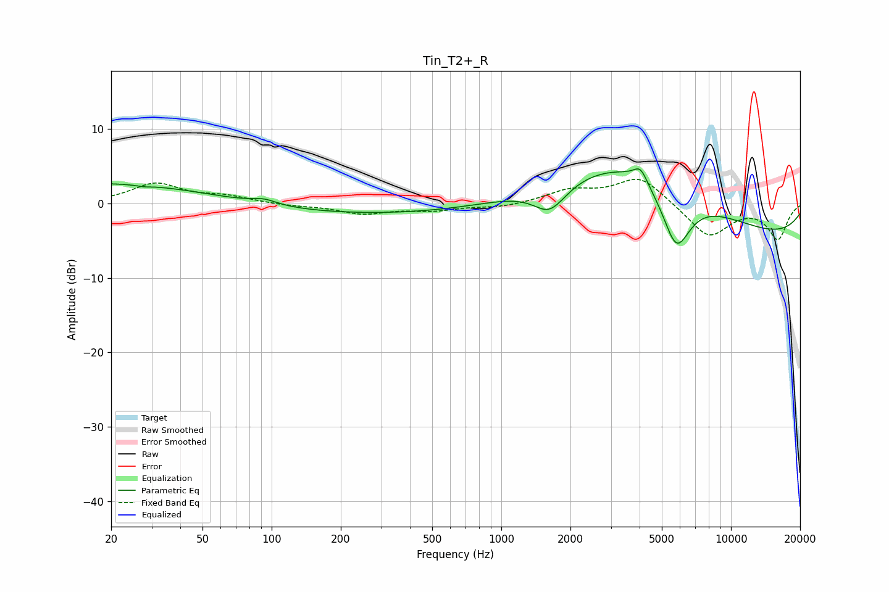

# Tin_T2+_R
See [usage instructions](https://github.com/jaakkopasanen/AutoEq#usage) for more options and info.

### Parametric EQs
Apply preamp of -4.8 dB when using parametric equalizer.

|   # | Type    |   Fc (Hz) |    Q |   Gain (dB) |
|-----|---------|-----------|------|-------------|
|   1 | Peaking |        20 | 0.27 |         2.9 |
|   2 | Peaking |        28 | 5.16 |        -0.1 |
|   3 | Peaking |        29 | 3.85 |        -0   |
|   4 | Peaking |        93 | 2.6  |         0.7 |
|   5 | Peaking |       281 | 0.18 |        -1.6 |
|   6 | Peaking |      1626 | 1.97 |        -3.7 |
|   7 | Peaking |      3708 | 0.41 |         9.5 |
|   8 | Peaking |      4034 | 4.71 |         1.9 |
|   9 | Peaking |      5777 | 2.15 |        -8.3 |
|  10 | Peaking |      9509 | 0.2  |        -5.2 |

### Fixed Band EQs
When using fixed band (also called graphic) equalizer, apply preamp of **-3.4 dB** (if available) and set gains manually with these parameters.

|   # | Type    |   Fc (Hz) |    Q |   Gain (dB) |
|-----|---------|-----------|------|-------------|
|   1 | Peaking |        31 | 1.41 |         2.6 |
|   2 | Peaking |        62 | 1.41 |         0.9 |
|   3 | Peaking |       125 | 1.41 |        -0.3 |
|   4 | Peaking |       250 | 1.41 |        -1.3 |
|   5 | Peaking |       500 | 1.41 |        -0.8 |
|   6 | Peaking |      1000 | 1.41 |        -0.5 |
|   7 | Peaking |      2000 | 1.41 |         1.7 |
|   8 | Peaking |      4000 | 1.41 |         3.6 |
|   9 | Peaking |      8000 | 1.41 |        -4.5 |
|  10 | Peaking |     16000 | 1.41 |        -4.7 |

### Graphs

